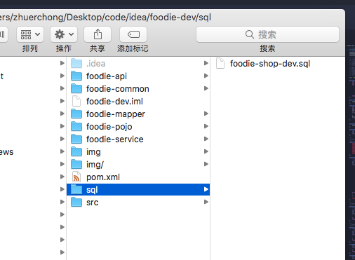
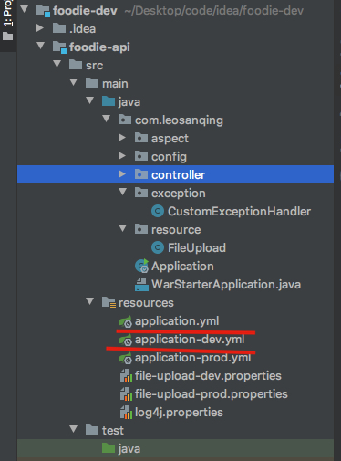
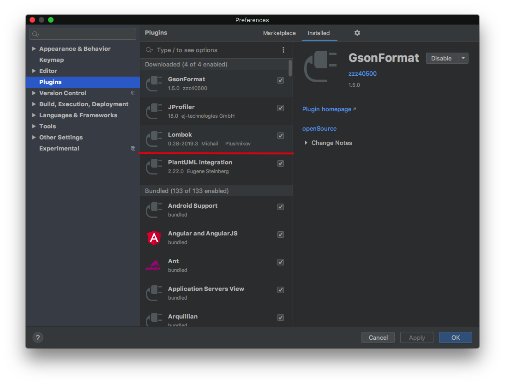
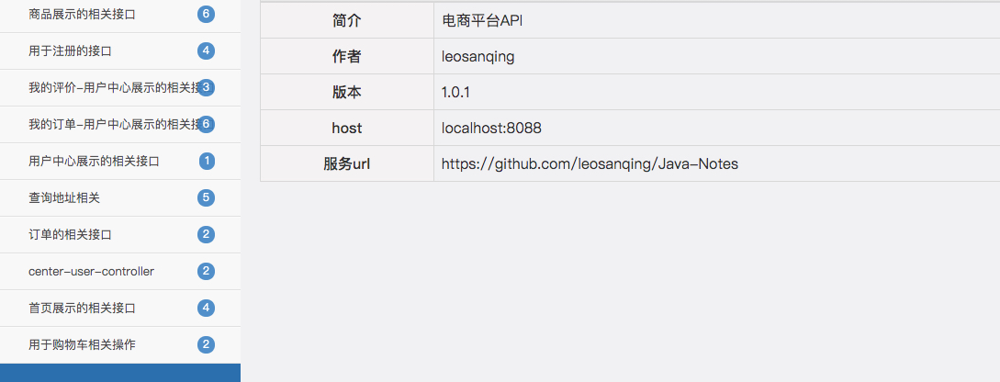

# 前言

这个1.0主要讲述环境的准备，项目的搭建运行。这个是全部的基础

# 目标

1.0的目标只是能够在本地跑起来，整个环节调通。

# 需要做的工作

其实1.0 主要是各种工具的下载

## 环境

1. JDK8

2. tomcat9(用于部署前端)

3. Mysql 5.7.24

4. idea 的lombok插件。@Data注解用

   

## 工具

1. idea
2. VSCode(前端用，其他的也行，直接使用txt也行，反正改不了多少东西)
3. Navicat(数据库用)
4. Parallel 部署虚拟机 centos7
5. secureCRT 链接虚拟机
6. postman 测试端口
7. filezilla 传输文件使用

# 前端

## tomcat

1. 去tomcat 官网下载 [下载地址](https://tomcat.apache.org/download-90.cgi) 



如果你是 mac 或者 windows，下载第一个，linux 环境下载第二个

2. 将 **frontend** 文件夹下的 **foodie-center.zip** 和 **foodie-shop.zip** 这两个压缩包解压之后，放到tomcat目录下的

**webapps**下

3. 到上图的 bin的目录下 启动 startup。 Mac 在**当前目录下**启动` startup.sh`文件。 windows启动 `startip.bat`文件
   - `./startup.sh` 如果报错，一般可能是权限问题。 再试下 `sudo startup.sh`。输入密码之后再看看

## ip

如果你要部署到线上，或者虚拟机上。前端和后端相应的ip要进行修改。

位置在每个前端文件的 `app.js`中 的这几句 `serverUrl`是后端的路由。如果你只是在本地跑，可以暂时不看这一步，因为现在不需要。只用localhost就行

# 后端

## 数据库

mysql 

1. 安装 mysql的环境，我的是5.7.24。(这个google一下)

2. 安装 navicat(主要用来图形化操作数据库的工具)

3. 然后将 sql文件导入。如果安装好 navicat google一下如何导入sql文件。sql文件在 项目的 sql目录下

   

   

项目中 sql的环境为 `url: jdbc:mysql://localhost:3306/foodie-shop-dev?useUnicode=true&characterEncoding=UTF-8&autoReconnect`

如果你的数据库的 `database`的名字不叫 `foodie-shop-dev`这个，需要改一下(如果导入的sql脚本，建立的库应该就是上面的名字)

**还有数据库的用户名和密码**，如果不一致也需要改一下。数据库的在 下面的 `application-dev.yml`文件中

其他一切环境配置都在 项目 `/foodie-api/src/main/resources/`目录下。

## 项目

1. 首先需要下载  lombok 插件，不然使用不了 @Data注解

Idea Mac 的快捷键是 `command + ,` windows 是`ctrl+alt+s`

2. 打开项目就行，第一版的是 这个 `foodie-dev-1.0.zip`，解压用idea打开就行
3. 之后导入相应的maven配置应该就可以运行了

后台项目的 路由为 `localhost:8088`，你运行起来之后，输入`localhost:8088/doc.html`能进入这个界面，应该就没问题了

当然正确的应该是你再使用`postman`访问一下，断点调试下。然后再结合前端和数据库调试下。

