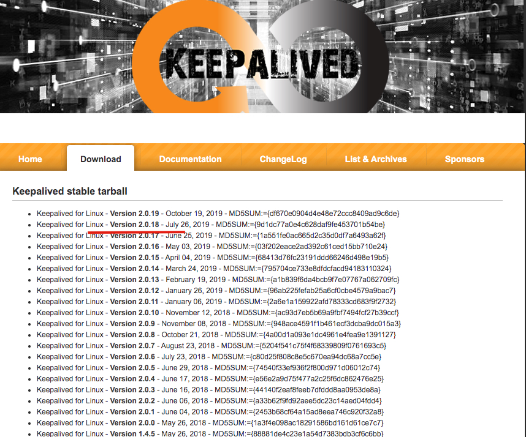
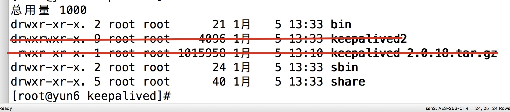
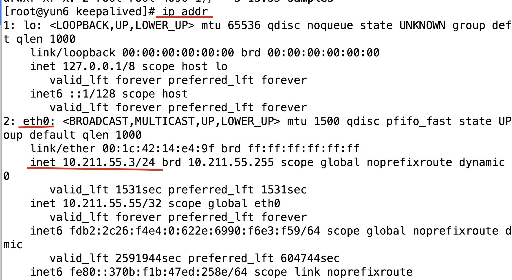
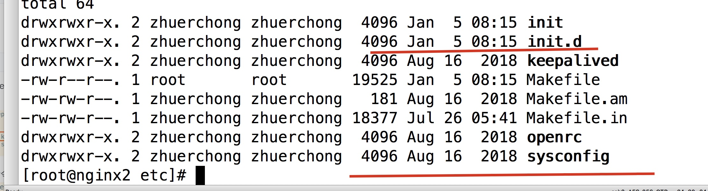
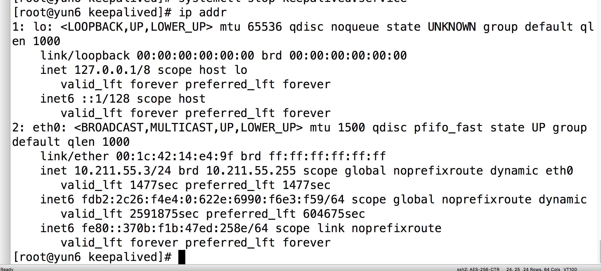
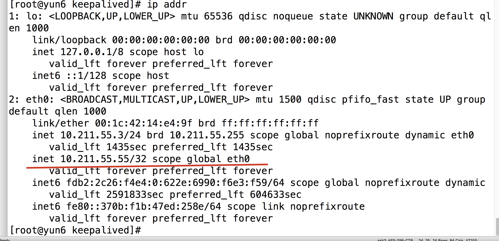
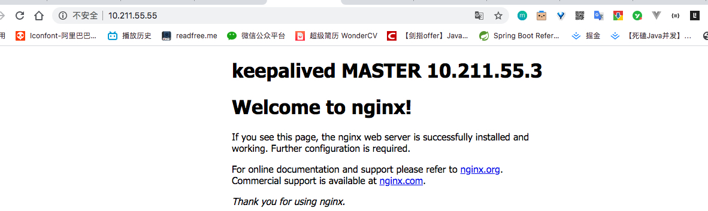

# Keepalived


# 场景

我们现在是使用**一台nginx，映射到了后台的集群，一共有三台后台服务器**，解决了如果后台服务器挂了，还可以访问后台应用。

但是，如果我的Nginx挂了，那你再部署10台，100台后台集群都没有用。因为根本不会有请求会到达tomcat中，让他们处理

这个keepalived就是来解决这个场景的情况的。

# 前提

我这个默认你已经安装了 Nginx(按照我的步骤来的)，不然最后的画面浏览器验证的方式是没用的。而且**可能会有依赖的错误**(比如 openssl)

# 配置

## 下载

首先去[官网下载软件](https://www.keepalived.org/)，我使用的是 2.0.18的版本



## 安装

### 上传至虚拟机

我们可以把它压缩包使用 **filezilla** 放到 linux 机器的 `/usr/software`文件夹下。(如果不知道filezilla 是什么或者不知道怎么用，可以看我这篇文章 filezilla )。

### 解压缩

使用 `tar -zxvf keepalived-2.0.18.tar.gz ` 将其解压缩。

### 安装

1. 进入 压缩后的文件夹，然后输入 `./configure --prefix=/opt/keepalived --sysconf=/etc`

   1. 其中`prefix`参数是配置你安装的目录。(我是所有安装的软件都放在 `/opt/{软件名}`下面，你可以根据自己的情况更改)
   2. 正常情况下都会报一个警告 `*** WARNING - this build will not support IPVS  ....`
   3. 我们先安装下这个环境 `yum -y install libnl libnl-devel`,之后在执行最上面的 `./configure --prefix=/opt/keepalived --sysconf=/etc`
   4. 如果你还报 openssl 什么的错误，那是缺少相应的依赖包,google一下相应的问题就行了(正常情况下是没有的，因为我们安装Nginx的时候已经安装过这个依赖了)

2. 然后执行安装命令：`make && make install`

3. 然后进入到 `/opt/keepalived`目录下，这个时候，应该有这三个 文件夹(红线划掉的不是这个步骤的)

   

## 配置

1. 我们进入 `/etc/keepalived`，我们的配置文件就放在这个目录下面

   

2. 使用 `vim keepalived.conf`。或者使用 `filezilla`在外部进行编辑都行

3. 正常情况下，这个文件有很多配置，我们不需要那么多，仅仅只用这些

   ```
   ! Configuration File for keepalived
   
   global_defs {
     
      # 路由id：当前安装keepalive 节点主机的标示符,全局唯一
      router_id keep_3
      
   }
   
   # 计算机节点
   vrrp_instance VI_1 {
       # 表示的状态，当前Nginx的主节点,MASTER/BACKUP
       state MASTER
       # 当前实例绑定的网卡
       interface eth0
   
       # 保证主备节点一致
       virtual_router_id 51
       # 优先级/权重 ，谁的优先级高，MASTER挂掉之后，就能成为主节点
       priority 100
       # 主备之间同步检查的时间间隔，默认1s
       advert_int 1
       # 认证授权的密码，防止非法节点的进入
       authentication {
           auth_type PASS
           auth_pass 1111
       }
       virtual_ipaddress {
           10.211.55.55
       }
   }
   
   
   ```

   我们看上面的配置， 其中 `router_id`后面的你可以更改。

   ### 注意：

   1. `interface `后面的 `etho`网卡，要根据自己的环境进行设置。

      使用 `ip addr`查看自己的 网卡名

      

   2. `virtual_router_id` 这个主备之间**一定要设置成一致**

   3. `priority` 主的一定要比备用的高，不然之后会有问题，主的复活了，可是还是发往备用机。自己可以试验

   4. `virtual_ipaddress`这个是你查看用的虚拟ip(vip)。一定要外部也能访问通。(我之前配置 10.211.5.161访问不通)

   # 启动/关闭

   ## 不加入服务组

   ### 启动

   1. 进入到你的安装目录 `cd /opt/keepalived/sbin`,
   2. 运行 `./keepalived`

   ### 关闭

   1. 查看进程 `ps -ef | grep keepalived`

      

   2. 然后关闭进程号 `kill 10217`

   

   ## 加入服务组

   1. 将这个 keepalived 加入Linux 的服务组,

      1. 进入到之前**解压的目录下**。`cd /usr/software/keepalived-2.0.18/`

      2. 进入 `cd keepalived/etc`,把下面两个里面的内容拷贝到系统目录下

         

      3. `cp init.d/keepalived /etc/init.d/`

      4. `cp sysconfig/keepalived /etc/sysconfig/`(如果问你是否覆盖 `cp: overwrite ‘/etc/sysconfig/keepalived’?` 输入 y，然后回车)

      5. 重启下进程 `systemctl daemon-reload`

   #### 启动

   `systemctl start keepalived.service`

   #### 关闭

   `systemctl stop keepalived.service`

4. 可以通过 `ps -ef | grep keepalived` 查看是否启动关闭是否正常

# 测试

## 先看 ip

我们注意`ip addr`里面的网卡。首先先将 `keepalived`关闭



然后再开启keepalived，再查看 ip



我们之前配置的 虚拟ip(vip)已经和 本机ip绑定了。说明之前的应该都正常了


## 再去 浏览器查看

输入 vip，地址.比如我的 `10.211.55.55`。浏览器是否是 nginx的画面




# 没达到预期原因分析

1. keepalived 启动之后，没有绑定 ip。
   1. 可能配置出现问题。请认真核查配置，查看我的配置步骤
   2. 配置之后没有重新启动
2. vip绑定,但无法访问到Nginx画面()
   1. 没有启动 Nginx
   2. ip 不互通，请使用 ping命令查看能否返回数据。我之前就是这个原因。(然后我修改了第三段ip就能访问了 之前是10.211.5.161)
   3. 是否设置了防火墙。直接访问 Nginx试试看

