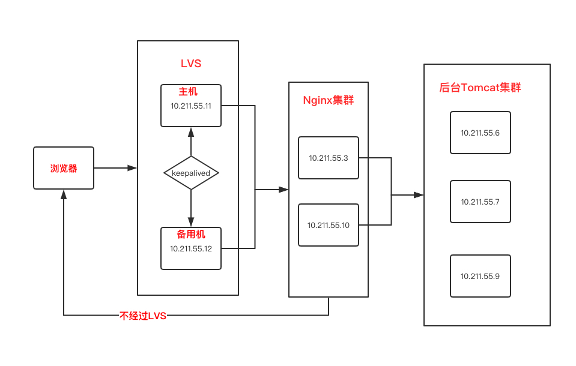
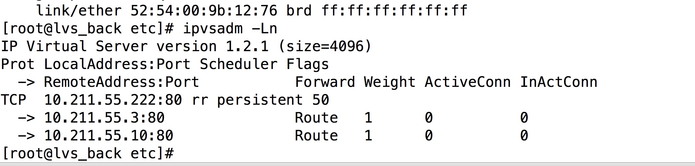
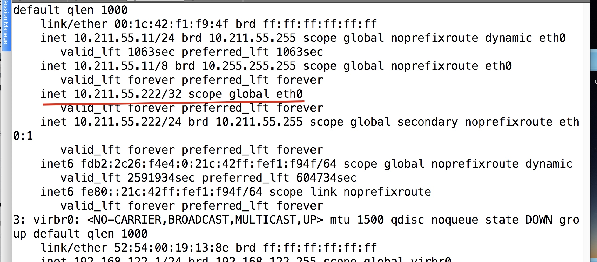
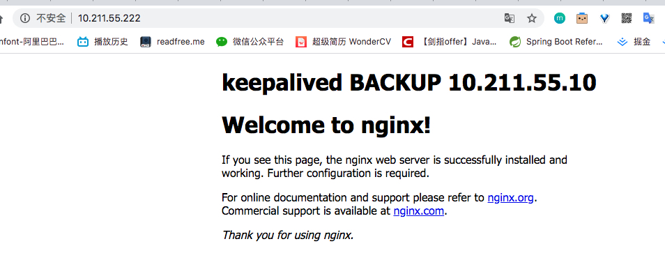

# 背景

之前讲了使用 Keepalived实现高可用，然后使用 LVS 实现接收更多请求。这个时候就需要两者集合实现 高可用+高并发了

我们需要四台机器。两台用来部署 LVS+Keepalived 两台用来部署Nginx。




# 安装

**注意：Keepalived 和ipvsadm 都要同时安装在一个机器上**。也就是说 其中两台要同时安装 这两个软件。另外两台安装Nginx

## 安装 Nginx


## 安装和配置 Keepalived

具体安装步骤可以看我的这篇文章 [Keepalived](https://github.com/leosanqing/food-shop/tree/master/2.0/blog/keepalived)

## 安装和配置 Ipvsadm

这步可以看这篇文章 [LVS](https://github.com/leosanqing/food-shop/tree/master/2.0/blog/lvs)

# 配置

如果之前看过，或者安装好了，就会很简单。

只需要改一个配置文件即可 `vim /etc/keepalived/keepalived.conf`

```javascript
! Configuration File for keepalived

global_defs {
   

   router_id LVS_12

}

vrrp_instance VI_1 {
    state BACKUP
    interface eth0
    virtual_router_id 55
    priority 50
    advert_int 1
    authentication {
        auth_type PASS
        auth_pass 1111
    }
    virtual_ipaddress {
        10.211.55.222
    }
}

# 虚拟ip地址，根据自己的实际情况更换
virtual_server 10.211.55.222 80 {
    # 健康检查的时间 单位：s
    delay_loop 6
    # 负载均衡算法
    lb_algo rr
    # LVS模式 NAT|TUN|DR
    lb_kind DR
    # 会话持久化时间
    persistence_timeout 50
    # 协议
    protocol TCP

    # 真实服务器地址 Nginx节点的地址
    real_server 10.211.55.3 80 {
        # 轮询的默认权重配比
        weight 1

        # 健康检查
        TCP_CHECK{
          # 检查的端口
          connect_port 80
          # 超时时间
          connect_timeout 2
          # 重试次数
          nb_get_retry 2
          # 重试的间隔时间
          delay_before_retry 3
        }
    }

    real_server 10.211.55.10 80 {
        weight 1

        # 健康检查
        TCP_CHECK{
          # 检查的端口
          connect_port 80
          # 超时时间
          connect_timeout 2
          # 重试次数
          nb_get_retry 2
          # 重试的间隔时间
          delay_before_retry 3
        }
    }
}


```


# 注意

上述的配置文件这几个地方需要根据你自己的实际情况进行更改

1. state ：(MASTER/BACKUP) 主机还是备用机
2. virtual_ipaddress : 虚拟ip地址，根据自己的实际情况改(不会的话可以参考 安装配置 Keepalived的那篇文章)
3. Virtual_server ：虚拟ip的地址 根据自己实际情况更改
4. real_server : 真是服务器地址，即你的Nginx地址。其他的一般不用改


# 测试


1. 如果都按照我的步骤配置好了，要先将 LVS的配置清空

`ipvsadm -C`

2. 在安装了 Keepalived 的 Master 机器上 。启动 Keepalived 服务即可

`systemctl start keepalived.service`

3. 然后 再 输入 `ipvsadm -Ln`。正常情况下会有两台 Nginx



然后 我们查看 ip `ip addr`.注意看，下面也有一个相同的ip。(如果你是按照我的步骤来的会有，这个是我们之前配置 eth0:1的时候设置的虚拟ip，划线的才是配置好了 Keepalived之后的ip绑定)




5. 我们访问虚拟Ip，正常会有这样的页面



6. 然后我们把 MASTER 机器停掉。`systemctl stop keepalived.service`。访问虚拟ip仍然正常，那就正常了

# 可能会出现的问题

1. 输入 虚拟ip无法访问页面。首先检查 你的虚拟机的防火墙，如果开启，则使用命令关闭
2. 然后可以参考 [Keepalived](https://github.com/leosanqing/food-shop/tree/master/2.0/blog/keepalived)这篇文章的问题。

