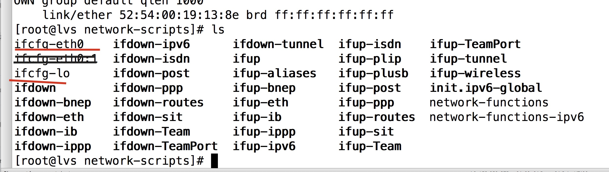
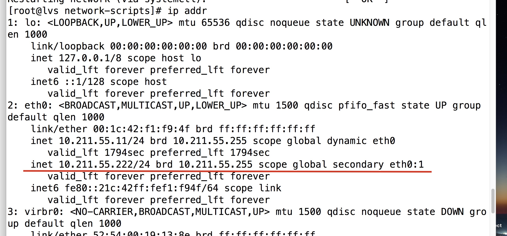
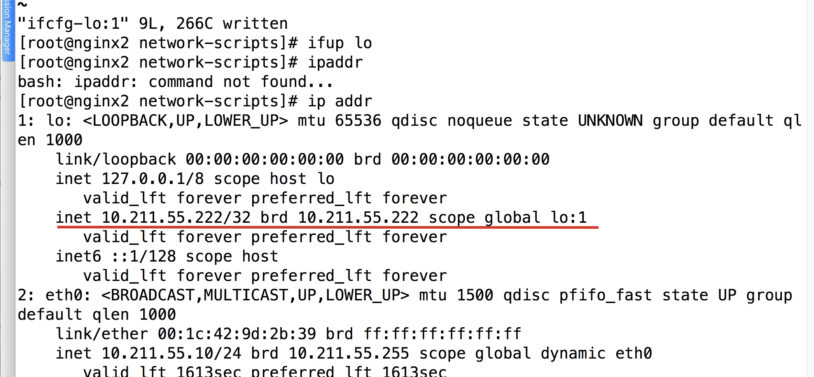
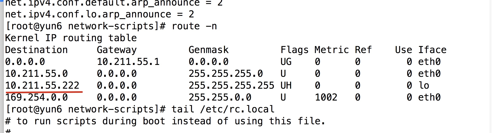
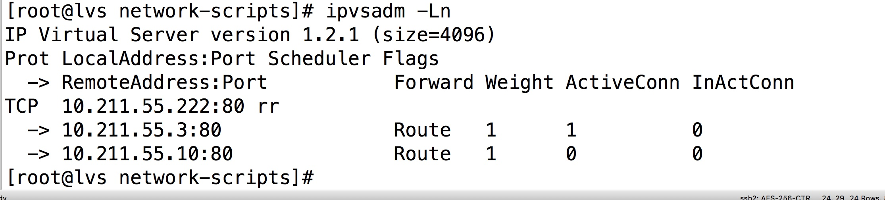
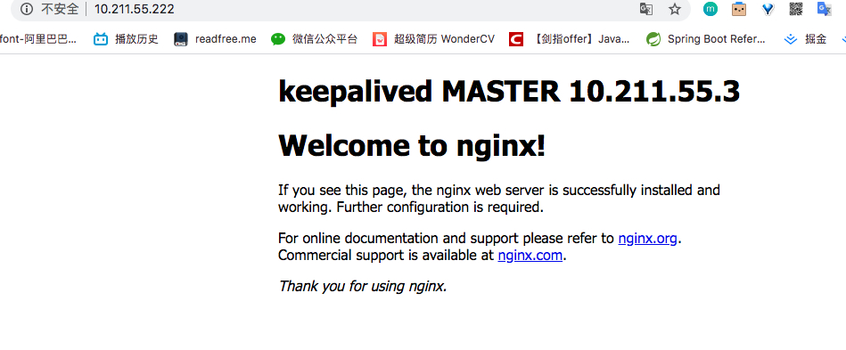

# 背景

我们已经通过 Nginx的Upstream 配置了后台的集群，并且通过Keepalived 配置了 Nginx的主备份机

但是，**Nginx的处理能力是有限的**，如果短时间大量请求访问Nginx，那么Nginx会宕机。

这个时候，LVS就要上场了


## LVS+Nginx的前提

**要有至少三台虚拟机或者服务器，并且其中两个安装了Nginx**。

如果没有安装Nginx可以参考下我的这篇文章，[keepalived配置主备机](https://github.com/leosanqing/food-shop/blob/master/2.0/blog/keepalived/README.md) 里面有Nginx的安装步骤。


# 好处


# 配置 

## 关闭网关(不关闭可能会有问题)

1. `systemctl stop NetworkManager`
2. `systemctl disable NetworkManager`
3. `systemctl stop firewalld.service`
4. `systemctl disable firewalld.service`

## 添加配置


1. 进入配置目录 `cd /etc/sysconfig/network-scripts/`

2. 有如下文件 ，我们需要改的是红线的两个

   

### eth0(lvs所在的机器  10.211.55.11)

1. 拷贝一份新的 `cp ifcfg-eth0 ifcfg-eth0:1`(如果不是eth0，请根据自己的名字进行相应更改)

   将内容改为 `vim ifcfg-eth0:1`

   ```javascript
   DEVICE="eth0:1" 
   BOOTPROTO="static"
   ONBOOT="yes"
   IPADDR=10.211.55.222 # 这个虚拟网关。根据自己的网关自行更改，不然可能无法ping通。如果是192.168.XX.XX 可能要改成 192.168开头的ip
   NETMASK=255.255.255.0
   ```

   

2. 重启网络配置

   `service network restart`

3. 查看是否成功 `ip addr`

   

   


### lo(Nginx所在的机器 10.211.55.3 和10.211.55.10)

1. 拷贝一份新的 `cp ifcfg-lo ifcfg-lo:1`

2. 将内容改为  `vim ifcfg-lo:1`

   ```javascript
   DEVICE=lo:1
   IPADDR=10.211.55.222 # 根据自己的实际vip进行更改。和上面的保持一致
   NETMASK=255.255.255.255
   NETWORK=127.0.0.0
   # If you're having problems with gated making 127.0.0.0/8 a martian,
   # you can change this to something else (255.255.255.255, for example)
   BROADCAST=127.255.255.255
   ONBOOT=yes
   NAME=loopback
   ```

3. 刷新 配置 `ifup lo` 或者 `service network restart`

4. 查看端口 `ip addr`

   

5. 

    

## 配置相应级别

1. `vim /etc/sysctl.conf `

```javascript
net.ipv4.conf.all.arp_ignore = 1
net.ipv4.conf.default.arp_ignore = 1
net.ipv4.conf.lo.arp_ignore = 1
net.ipv4.conf.all.arp_announce = 2
net.ipv4.conf.default.arp_announce = 2
net.ipv4.conf.lo.arp_announce = 2
```

2. 刷新配置 `sysctl -p`

3. 添加路由 `route add -host 10.211.55.222 dev lo:1` （ip 根据自己的虚拟ip进行更换）

   1. 这种配置重启就会失效，将命令添加进启动项 `echo "route add -host 10.211.55.222 dev lo:1" >> /ect/rc.local`

4. 查看是否成功 `route -n`

   

5. 

# 配置集群

(我只配置了其中一个Nginx的地址，另外一个和上述相同，自行配置即可)

## 安装Ipvsadm

`yum install ipvsadm `

## 添加虚拟ip

`ipvsadm -A -t 10.211.55.222:80 -s rr`(ip 改成自己配置的虚拟ip,rr只负载均衡算法为轮询方式)

## 添加集群(真实ip)

1. 第一个 `ipvsadm -a -t 10.211.55.222:80 -r 10.211.55.3:80 -g`
2. 第二个 `ipvsadm -a -t 10.211.55.222:80 -r 10.211.55.10:80 -g`

## 查看是否成功

`ipvsadm -Ln`




# 测试

输入 虚拟地址是否能访问到  Nginx `http://10.211.55.222`(我这个只是改了Nginx的主页，便于查看集群是否正常工作)




这个默认情况下，他有一个 300s 的时间，如果再次请求，还是访问之前的ip。

## 设置时间（为了方便测试）

1. `ipvsadm -E -t 10.211.55.222:80 -s rr -p 5`
2. `ipvsadm --set 1 1 1`

可以使用这个命令查看失效时间  `ipvsadm -Lnc`


