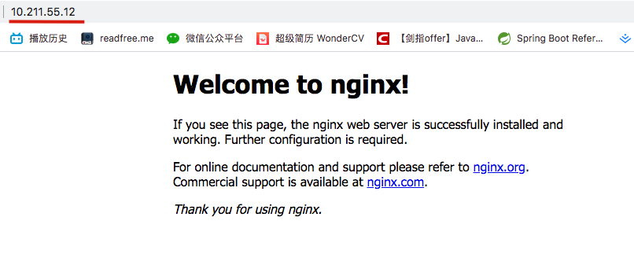

# 安装

## 官网下载

进入Nginx官网，[然后点击下载](https://nginx.org/download/nginx-1.16.1.tar.gz)

下载之后我们使用 filezilla 将其上传至我们的虚拟机(如果不知道 filezilla 可以看我的这篇文章  [filezilla使用](https://github.com/leosanqing/food-shop/tree/master/tools/filezilla) )


## 配置环境安装

1. yum install gcc-c++
2. yum install -y pcre pcre-devel
3. yum install -y zlib zlib-devel
4. yum install -y openssl openssl-devel

## 安装 Nginx

1. 解压 `tar -zxvf {文件名}`

2. 创建文件夹 `mkdir /var/temp/nginx -p`

3. 进入 Nginx文件目录 。第二行是我们的安装目录  可以自行修改

   ```javascript
   ./configure \
   --prefix=/opt/nginxNew \
   --pid-path=/var/run/nginx/nginx.pid \
   --lock-path=/var/lock/nginx.lock \
   --error-log-path=/var/log/nginx/error.log \
   --http-log-path=/var/log/nginx/access.log \
   --with-http_gzip_static_module \
   --http-client-body-temp-path=/var/temp/nginx/client \
   --http-proxy-temp-path=/var/temp/nginx/proxy \
   --http-fastcgi-temp-path=/var/temp/nginx/fastcgi \
   --http-uwsgi-temp-path=/var/temp/nginx/uwsgi \
   --http-scgi-temp-path=/var/temp/nginx/scgi \
   ```

4. 编译安装  `make && make install`

## 启动

1. 进入 我们之前设置的安装目录 `cd /opt/nginxNew`
2. 进入 sbin 文件夹  然后 `./nginx`

## 验证

在浏览器输入 你的ip地址



## 可能失败的原因

1. 没有关闭防火墙 `systemctl stop firewalld.service`