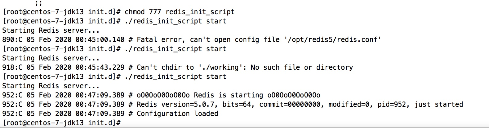
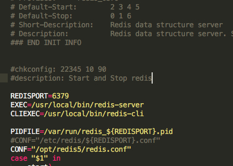

# 前言

我们通过和数据库的交互获取数据，但是某些数据加载会严重影响性能，因为查询数据库是一个比较耗时的事情。我们能不能提高查询数据的效率？

这个时候我们就需要使用 redis了。(当然提升查询效率不只有redis)


## 其他redis相关 (待更新)

1. 设置主从复制
2. Redis 为啥会这么快
3. Redis常用的命令和数据结构

# 安装和配置

## 下载

到官网下载redis [https://redis.io/download](https://redis.io/download)

然后通过filezilla上传至相应的虚拟机 我上传至`/opt`文件夹下

## 安装

1. 使用 解压缩命令解压文件`tar -zxvf <压缩包名>`
2. 进入文件夹后 会发现有一个 **Makefile**文件，使用 `make && make install` 
3. 安装的时候可能报错，缺少gcc依赖。使用 `yum install gcc-c++`安装一下就行

## 配置

1. 进入redis目录下，打开 `redis.conf` 文件 `vim redis.conf`

2. 找到如下参数，并修改

   ```javascript
   # The working directory.
   #
   # The DB will be written inside this directory, with the filename specified
   # above using the 'dbfilename' configuration directive.
   #
   # The Append Only File will also be created inside this directory.
   #
   # Note that you must specify a directory here, not a file name.
   #工作目录，持久化 aof rdb都会存放在这个目录下，如果修改了 需要创建相应的目录
   dir /opt/redis5/working
   
   # IF YOU ARE SURE YOU WANT YOUR INSTANCE TO LISTEN TO ALL THE INTERFACES
   # JUST COMMENT THE FOLLOWING LINE.
   # ~~~~~~~~~~~~~~~~~~~~~~~~~~~~~~~~~~~~~~~~~~~~~~~~~~~~~~~~~~~~~~~~~~~~~~~~
   # 将127.0.0.1 改成 0.0.0.0 所有ip都能访问
   bind 0.0.0.0
   
   # 保护模式关闭
   protected-mode no
   
   # By default Redis does not run as a daemon. Use 'yes' if you need it.
   # Note that Redis will write a pid file in /var/run/redis.pid when daemonized.
   # 是否后台运行，设置成yes
   daemonize yes
   
   # 还有其他一下参数，比如 密码什么的，因为是在虚拟机上运行，所以不需要设置
   ```

## 启动

1. 将redis目录下的 /utils/ 的 `redis_init_script`文件复制到 `/etc/init.d/`下 。 `cp redis_init_script /etc/init.d/`
2. 进入目录`cd /etc/init.d`，修改相应文件 `vim redis_init_script` 将其配置文件路径改成 我们的配置文件存放的路径`CONF="/opt/redis5/redis.conf"`
3. 赋予权限 `chmod 777 redis_init_script`。
4. 启动 `./redis_init_script` start`




## 查看是否启动成功

查看进程号 `ps -ef|grep redis`


## 设置自启动

1. `vim /etc/init.d/redis_init_script` 添加如下内容

   ```javascript
   
   #chkconfig: 22345 10 90
   #description: Start and Stop redis
   ```

   

## 验证

重启虚拟机 `reboot`。再查看进程号是否存在