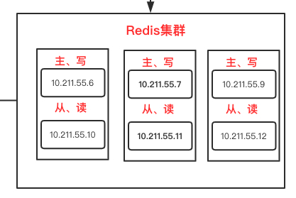

# 前言

之前我们已经配置了Redis主从复制，并且我们也配置了哨兵。以此来增加我们系统的 并发性和高可用性

但是，哪怕进行了 redis主从复制，实现读写分离，但是我们也只有一台redis，也会到达redis的极限。

这个时候我们就需要配置**redis集群**了

架构图如下

## 前提条件

我们需要至少**6台**虚拟机并且配置好redis环境。为啥需要6台，后面你就知道了

# 集群配置

1. 如果你之前配置哨兵，请先将