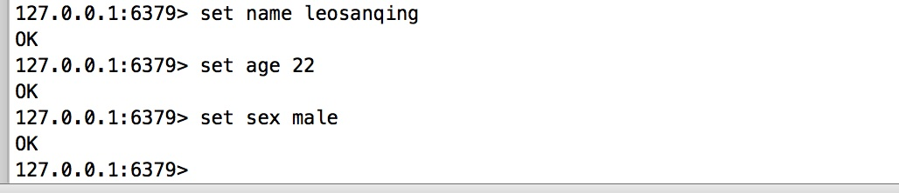
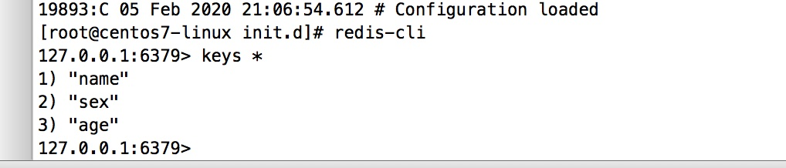
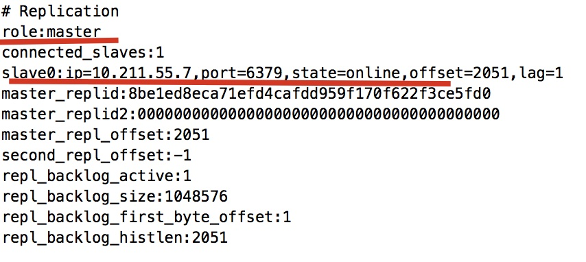
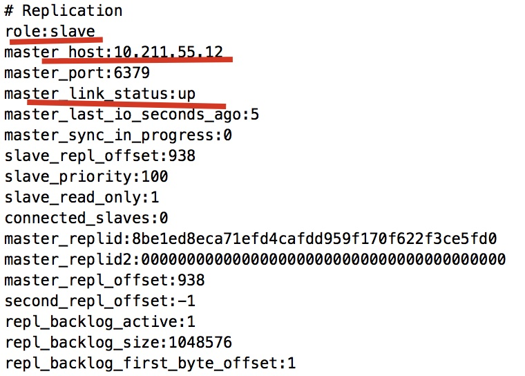
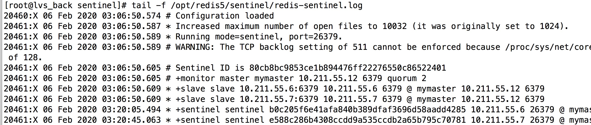

# 前言

我们已经安装和配置好了redis。但是随着业务扩大，并发上升，redis压力会很大，并且由于是单个服务器，如果这个服务器数据丢失，那么数据就真的全部丢失了

这个时候，就需要用到**redis的主从复制**了

这篇讲怎么**配置主从以及怎么设置哨兵，提升并发和高可用**

## 好处

1. 减少单个redis的压力，读取不从主节点读取
2. 备份数据
3. 提升高可用性

## 前提条件

1. 两台虚拟机，并且配置好了redis环境(如果没有配置好，可以先看怎么安装和配置redis环境)

# 主从复制

## 配置主从

1. 找到redis目录下的配置文件`redis.conf`，修改这个参数(只修改从节点的redis配置文件，主节点的不需要修改)

   

   ```javascript
   # replicaof <masterip> <masterport>
   # 节点和端口为主节点的ip和端口
   replicaof 10.211.55.12 6379
   
   # 如果主节点设置了 密码，需要修改这个参数
   # masterauth <master-password>
   
   # 这个表示从节点只可以读，不可以进行写操作
   replica-read-only yes
   ```

   

2. 重启服务 `/etc/init.d/redis_init_script stop` 和`/etc/init.d/redis_init_script start`

## 测试验证

1. 我们通过redis客户端`redis-cli`在主节点中存入几个元素

   

2. 然后在从节点查看下元素 ,可以看到已经复制过来了

   

3. 我们也可以通过 `info`命令查看 在redis客户端中输入 `info`。可以看到他们已经关联上了

   

   

4. 

# 哨兵

## 背景

> 配置主从复制后，我们减轻了压力，提高了并发能力。但是如果我们的主节点挂了，那这个主从复制也就全部挂了。
>
> 想想之前我们提升高可用的两个工具，keepalived和LVS，那么有没有类似的工具，能够让 从节点变成主节点然后继续工作呢？
>
> 答案是，有的，那就是哨兵(Sentinel)

## 配置

配置哨兵很简单，但是配置哨兵的前提条件是已经按照上面配置好了**主从复制**

1. 我们找到 哨兵的配置文件(主从节点的机器都要配置，而且都一样可以复制)，和`redis.conf`文件在同一级，有个`sentinel.conf`，编辑他`vim sentinel.conf`

2. 我们需要修改这几个参数

   ```javascript
   # 将保护模式关闭，否则可能会导致其他虚拟机不能访问
   protected-mode no
   
   # 开启后台运行
   daemonize yes
   
   # log文件的存放目录，可以根据自己的情况进行修改，但是一定要新建文件夹，不然启动会报错
   logfile "/opt/redis5/sentinel/redis-sentinel.log"
   
   # 工作目录，最好和上面的目录保持一致
   dir "/opt/redis5/sentinel"
   
   # 主节点的ip地址，后面的是投票的个数(2表示，至少有两个哨兵发现这个节点无法ping通才认为他宕机了)
   # 注意mymaster 这个变量，这个表示我们的主节点的别名，如果修改了，一定要记住，因为后面项目配置要用到
   sentinel monitor mymaster 10.211.55.12 6379 2
   ```

   

3. 新建哨兵的目录 `mkdir /opt/redis5/sentinel`.(请改成上面配置文件中配置的目录)

4. 可以将配置好的文件复制到其他两台从节点机器上 使用远程复制命令`scp /opt/redis5/sentinel.conf root@<从节点的ip>:/opt/redis5/ `（注意ip后面需要添加一个冒号:,并且路径需要根据自己的实际情况进行修改）

## 启动

1. 先启动主节点
2. 先将 redis进行重启一次。`/etc/init.d/redis_init_script stop`和`/etc/init.d/redis_init_script start`
3. 进入 `sentinel.conf`所在的目录，然后执行 redis-sentinel sentinel.conf
4. 其他两个从节点机器重复上述操作

## 验证是否成功

1. 查看 日志文件，

   

2. 我们看到最后两行，其他两个从节点的哨兵已经加进去了

3. 我们可以将主节点的机器关闭，`/etc/init.d/redis_init_script stop`查看其他两个机器是否有一台的角色变成了`master`。(具体步骤看上面的主从复制 的 info 命令）

# 注意

还记得之前的 LVS+keepalived 吗，当我们配置的是MASTER时，当这台机器挂掉，备用机启动，但是当 MASTER这台机器重新启动之后，MASTER 这台机器还是MASTER，之前启动的备用机又不工作了

但是这个不一样，如果之前的Master挂掉，然后再重启之后，他是不会再重新变成Master的，他会变成 **从节点**

有兴趣的可以尝试一下

要学习回顾并对比之前学过的知识哦


