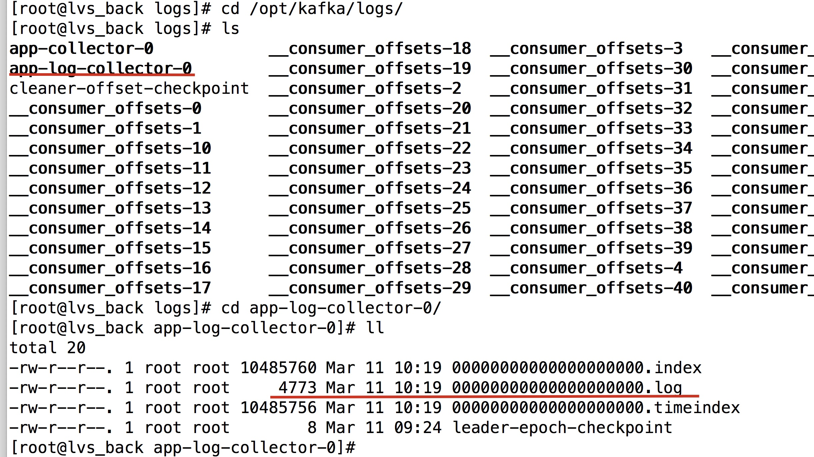
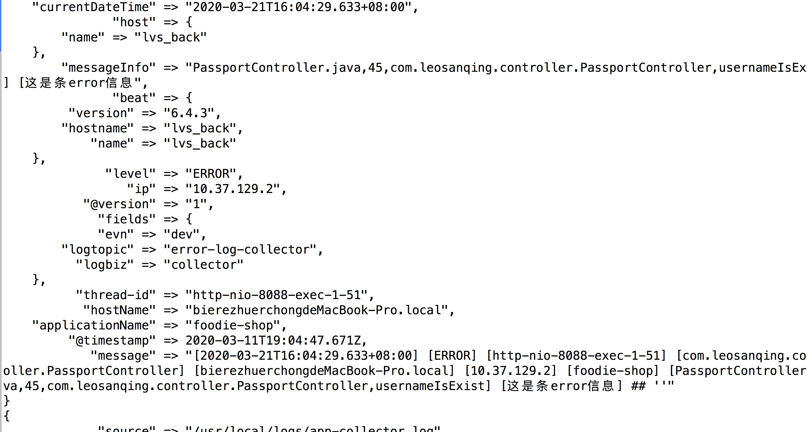
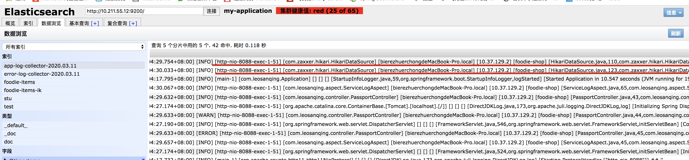

# 前言

使用 ELK+Kafka 首先需要安装相应的软件，我安装的都是 6.4.3的版本，不同的版本可能会有冲突。一些地方可能更改

其中这几个工具的作用分别是

- FileBeat 收集过滤日志文件。将日志文件收集后发送至kafka
- Kafka 作为日志的吞吐程序，消息中间件
- LogStash 从Kafka 中取出数据，然后发送至 ES
- ES 作为日志的搜索工具
- Kibana 作为日志可视化工具

# 下载

如果去官网下载可能会很慢，可以先去这个网站找下有没有软件

[http://newbe.pro/tags/Mirrors/page/3/](http://newbe.pro/tags/Mirrors/page/3/)

# Kafka

可以参考这篇博文 [kafka的安装和配置](https://github.com/leosanqing/food-shop/tree/master/3.0/blog/kafka/kafka%E5%AE%89%E8%A3%85%E5%92%8C%E9%85%8D%E7%BD%AE) 

然后根据里面的命令 新建两个topic `app-log-collector`和 `error-log-collector`

启动之后不要关，不然后面filebeat会报错

# FileBeat

## 安装

下载后使用 tar命令解压即可


## 配置

我们修改 文件夹下的 filebeat.yml 文件,可以直接替换文件 里面的内容

```yaml
filebeat.prospectors:

- input_type: log
	# log文件的地址
  paths: 
    - /usr/local/logs/app-collector.log
  document_type: "app-log"
  multiline:
    pattern: '^\['
    negate: true
    match: after
    max_lines: 2000
    timeout: 2s
  fields:
    logbiz: collector
    logtopic: app-log-collector
    evn: dev
    

- input_type: log
  paths: 
    - /usr/local/logs/error-collector.log
  document_type: "error-log"
  multiline:
  	# 匹配的开头 
    pattern: '^\['
    negate: true
    match: after
    max_lines: 2000
    timeout: 2s
  fields:
    logbiz: collector
    logtopic: error-log-collector
    evn: dev


# output.console:
#   enabled: true
#   pretty: true
#   codec.format.string: '%{[message]}'

output.kafka:
  enable: true
  hosts: ["10.211.55.12:9092"]
  topic: '%{[fields.logtopic]}'
  partition.hash:
    reachable_only: true
  compression: gzip
  max_message_bytes: 1000000
  required_acks: 1
logging.to_files: true

```

我们注意到上面的几个参数，这个是跟我们项目中的日志文件中的配置是一致的 `log4j2.xml`

```xml
<?xml version="1.0" encoding="UTF-8"?>
<Configuration status="INFO" schema="Log4J-V2.0.xsd" monitorInterval="600" >
    <Properties>
        <Property name="LOG_HOME">logs</Property>
        <property name="FILE_NAME">collector</property>

        <!--  [%d{yyyy-MM-dd'T'HH:mm:ss.SSSZZ}] 美国时间
              [%level{length=5}] 日志等级
              [%thread-%tid] 线程名
              [%logger] 哪个类的名称
              [%X{hostName}] 主机名
              [%X{ip}] 主机ip
              [%X{applicationName}]
              [%F,%L,%C,%M] F file当前执行的文件是哪个，L line 第几行, C class, M method 执行的函数
              [%m] message 输入的日志信息
              ## '%ex'%n ex 异常
        -->

        <property name="patternLayout">[%d{yyyy-MM-dd'T'HH:mm:ss.SSSZZ}] [%level{length=5}] [%thread-%tid] [%logger] [%X{hostName}] [%X{ip}] [%X{applicationName}] [%F,%L,%C,%M] [%m] ## '%ex'%n</property>
    </Properties>
    <Appenders>
        <Console name="CONSOLE" target="SYSTEM_OUT">
            <PatternLayout pattern="${patternLayout}"/>
        </Console>  
        <RollingRandomAccessFile name="appAppender" fileName="${LOG_HOME}/app-${FILE_NAME}.log" filePattern="${LOG_HOME}/app-${FILE_NAME}-%d{yyyy-MM-dd}-%i.log" >
          <PatternLayout pattern="${patternLayout}" />
          <Policies>
              <TimeBasedTriggeringPolicy interval="1"/>
              <SizeBasedTriggeringPolicy size="500MB"/>
          </Policies>
          <DefaultRolloverStrategy max="20"/>         
        </RollingRandomAccessFile>
        <RollingRandomAccessFile name="errorAppender" fileName="${LOG_HOME}/error-${FILE_NAME}.log" filePattern="${LOG_HOME}/error-${FILE_NAME}-%d{yyyy-MM-dd}-%i.log" >
          <PatternLayout pattern="${patternLayout}" />
          <Filters>
              <ThresholdFilter level="warn" onMatch="ACCEPT" onMismatch="DENY"/>
          </Filters>              
          <Policies>
              <TimeBasedTriggeringPolicy interval="1"/>
              <SizeBasedTriggeringPolicy size="500MB"/>
          </Policies>
          <DefaultRolloverStrategy max="20"/>         
        </RollingRandomAccessFile>            
    </Appenders>
    <Loggers>
        <!-- 业务相关 异步logger -->
        <AsyncLogger name="com.leosanqing.*" level="info" includeLocation="true">
          <AppenderRef ref="appAppender"/>
        </AsyncLogger>
        <AsyncLogger name="com.leosanqing.*" level="info" includeLocation="true">
          <AppenderRef ref="errorAppender"/>
        </AsyncLogger>       
        <Root level="info">
            <Appender-Ref ref="CONSOLE"/>
            <Appender-Ref ref="appAppender"/>
            <AppenderRef ref="errorAppender"/>
        </Root>         
    </Loggers>
</Configuration>
```


## 验证

我们启动 filebeat 之后，`./filebeat` 前往 kafka的日志中查看，是否有数据更新就行。(注意，一定要先启动kafka)，不然会报错

因为我们现在没有消费端，所以无法查看我们里面的数据到底是啥样的，只能通过下面的文件是否有数据判断

请根据我图片中的命令自行修改成自己的环境地址




## 问题排查

如果没有达到效果，可能有以下几个问题，我遇到的。我都遇到过，所以你应该可能也会遇到

1. kafka没有启动
2. 配置有些地方不一致，请再三检查，如路径错误
3. 有些地方使用的中文符号 
4. 请启动 filebeat 之后再将日志文件放入相应的路径。如果不是这样可能没有数据，我之前就是

具体怎么查看，可以根据filebeat的日志文件查看。

我们进入 filebeat 的日志路径。我的是 `cd /opt/filebeat/logs`，然后对症下药

# LogStash

## 安装

1. 解压 `tar -zxvf {文件名}`
2. 进入文件之后，创建文件夹 `mkdir script`
3. 然后进入文件夹后，新建一个配置文件 touch 或者 vim 命令 . `vim logstash-script.conf`

## 配置

我们修改 `logstash-script.conf`

我们可以先将后面输出到 es 的配置先注释掉，因为我们现在还没有 es。我们只需要先打印到控制台就能验证是否正确了，记得更改成自己的地址

```javascript
input {
	kafka {
		# app-log-服务名称
		topics_pattern => "app-log.*"
		bootstrap_servers => "10.211.55.12:9092"
		codec => json
		consumer_threads => 4
		decorate_events => true
		# auto_offset_rest => "lastest"
		group_id => "app-log-group"
	}


	kafka {
		# app-log-服务名称
		topics_pattern => "error-log.*"
		bootstrap_servers => "10.211.55.12:9092"
		codec => json
		consumer_threads => 4
		decorate_events => true
		# auto_offset_rest => "lastest"
		group_id => "error-log-group"
	}
}


filter {
	# 时区转换
	ruby {
		code => "event.set('index_time',event.timestamp.time.localtime.strftime('%Y.%m.%d'))"
	}

	if "app-log" in [fields][logtopic]{
		grok {
      # 注意下面的这几个变量，和 我们的日志文件中的是一致的
			match => ["message" , "\[%{NOTSPACE:currentDateTime}\] \[%{NOTSPACE:level}\] \[%{NOTSPACE:thread-id}\] \[%{NOTSPACE:class}\] \[%{DATA:hostName}\] \[%{DATA:ip}\] \[%{DATA:applicationName}\] \[%{DATA:messageInfo}\] ## (\'\'|%{QUOTEDSTRING:throwable})"]
		}
	}


	if "error-log" in [fields][logtopic]{
		grok {
			match => ["message" , "\[%{NOTSPACE:currentDateTime}\] \[%{NOTSPACE:level}\] \[%{NOTSPACE:thread-id}\] \[%{NOTSPACE:class}\] \[%{DATA:hostName}\] \[%{DATA:ip}\] \[%{DATA:applicationName}\] \[%{DATA:messageInfo}\] ## (\'\'|%{QUOTEDSTRING:throwable})"]
		}
	}
}

output {
	stdout {codec => rubydebug}
}

# 如果没有es ，可以先注释下面的代码
output {
	if "app-log" in [fields][logtopic]{
		elasticsearch {
			# es 服务地址
			hosts => ["10.211.55.12:9200"]
			# 用户名密码
			# user => ""
			# password => ""
			index => "app-log-%{[fields][logbiz]}-%{[index_time]}"
			# 是否嗅探集群ip 一般设置为true
			# 通过嗅探机制 进行 es 集群负载均衡发日志消息
			sniffing => true
			# LogStash 默认自带一个mapping 模板，进行模板覆盖
			template_overwrite => true
		}
	}

	if "error-log" in [fields][logtopic]{
		elasticsearch {
			# es 服务地址
			hosts => ["10.211.55.12:9200"]
			# 用户名密码
			# user => ""
			# password => ""
			index => "error-log-%{[fields][logbiz]}-%{[index_time]}"
			# 是否嗅探集群ip 一般设置为true
			# 通过嗅探机制 进行 es 集群负载均衡发日志消息
			sniffing => true
			# LogStash 默认自带一个mapping 模板，进行模板覆盖
			template_overwrite => true
		}
	}

}
```

## 启动

这个是在 bin 目录下 也可以使用绝对路径

`./logstash -f ../script/logstash-script.conf`

这个如果报错就很简单，因为他直接在控制台打印错误

## 验证

我们可以在控制台看到相应的内容



# ES

ES的安装可以参考这篇博文 [ES安装和配置](https://github.com/leosanqing/food-shop/tree/master/3.0/blog/es/es%E5%AE%89%E8%A3%85%E5%92%8C%E9%85%8D%E7%BD%AE)

然后我们再将之前注释的代码 放开，记得更改成自己的配置

然后启动es之后，重新上传一下日志文件。如果是程序的话，可以直接访问接口，新增日志

## 验证

我们使用elasticsearch-header 查看我们的数据



# Kibana

