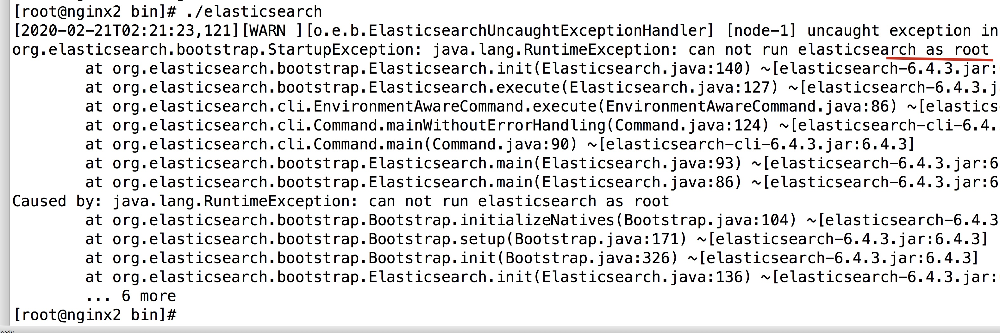
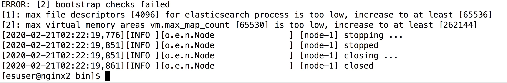
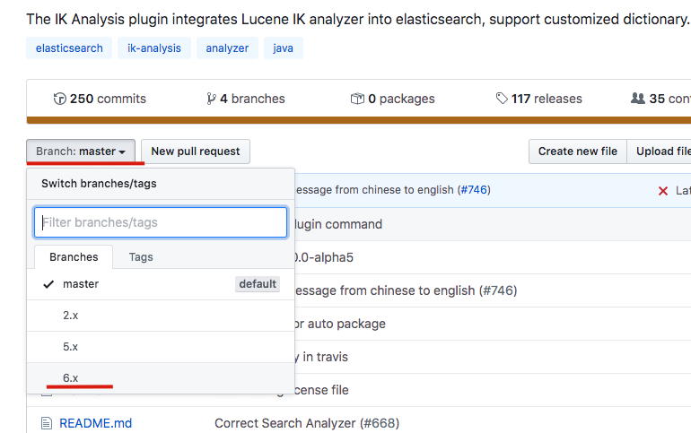
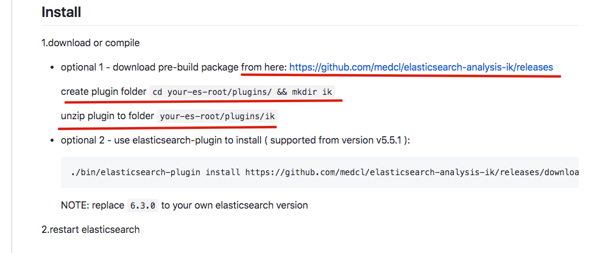
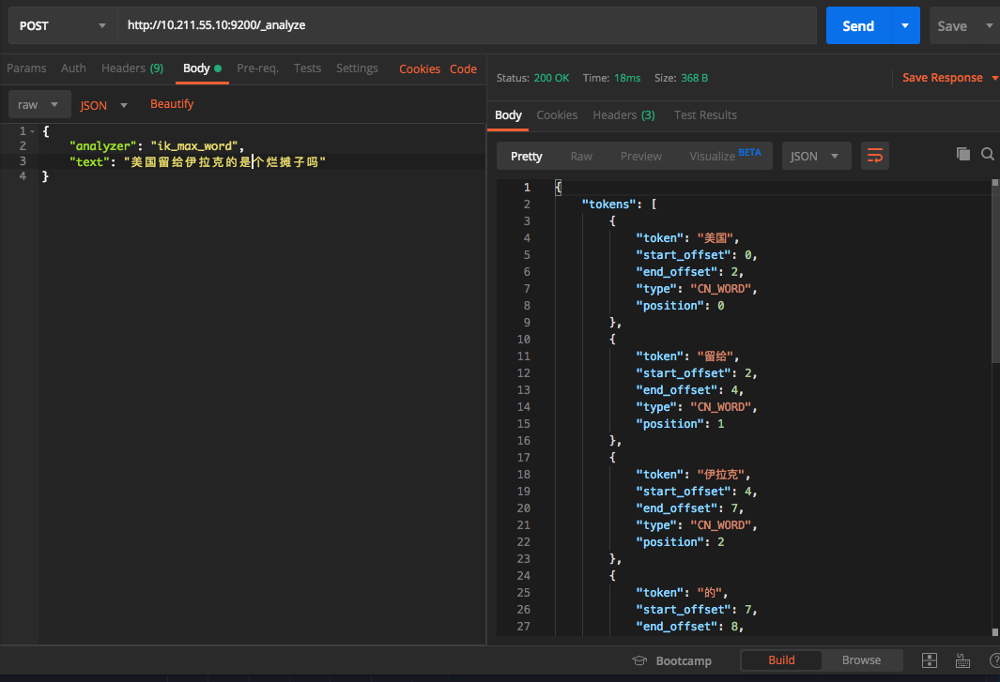

# 下载

进入es的官网下载，最好下载 6.4.3版本的，因为SpringBoot目前暂时只能整合6.4.3的，如果你下载他之后的版本，是不兼容的

可以使用下面的网站，也可以从es的官网下载

[https://thans.cn/mirror/elasticsearch.html](https://thans.cn/mirror/elasticsearch.html)


下载之后使用 filezilla 进行上传解压，如果不知道，可以看这个文章，[https://github.com/leosanqing/food-shop/tree/master/tools/filezilla](https://github.com/leosanqing/food-shop/tree/master/tools/filezilla)

# 配置

## conf文件

```javascript
cluster.name: my-application
node.name: node-1

# 数据存放地址
path.data: /opt/es6/data
# 日志存放地址
path.logs: /opt/es6/logs

network.host: 0.0.0.0

```

## 创建文件夹

在 es的目录下创建 data的文件夹 `mkdir /opt/es6/data`（我的es的目录为 /opt/es6，根据自己的情况设置）

## 创建用户

es 不能使用 root 用户运行，所以需要创建一个新的用户

- `useradd esuser`
- 切换成普通用户 `su esuser` 



## 设置其他属性

我们使用 `esuser`用户进入`bin`目录下运行`./elasticsearch`还是会出问题



我们一次解决这两个问题

- 切换回root用户，`su root`，`vim /etc/security/limits.conf`

```javascript
#@faculty        hard    nproc           50
#ftp             hard    nproc           0
#@student        -       maxlogins       4

# 添加以下内容

* soft nofile 65536
* hard nofile 131072
* soft nproc 2048
* hard nproc 4096
```

- 然后再编辑另一个文件 `vim /etc/sysctl.conf`

  添加 `vm.max_map_count=262145`

- 刷新配置 `sysctl -p`

- 重新启动

# 验证

我们启动之后，进入 输入ip和相应端口就行。默认端口为 9200

```json
{
  "name": "node-1",
  "cluster_name": "my-application",
  "cluster_uuid": "GIh0HkzYQO2kyIcW1vm2lw",
  "version": {
    "number": "6.4.3",
    "build_flavor": "default",
    "build_type": "tar",
    "build_hash": "fe40335",
    "build_date": "2018-10-30T23:17:19.084789Z",
    "build_snapshot": false,
    "lucene_version": "7.4.0",
    "minimum_wire_compatibility_version": "5.6.0",
    "minimum_index_compatibility_version": "5.0.0"
  },
  "tagline": "You Know, for Search"
}
```

如果有一下内容，那么说明配置成功了

# 后台启动

如果后台启动，使用 `./elasticsearch -d`


# 安装es-header

可进行ES的各种管理

科学上网，如果使用的是谷歌浏览器，在 **谷歌应用商店**中搜索`elasticsearch`。 下载即可


# 中文分词器

## 安装

去github上下载 [https://github.com/medcl/elasticsearch-analysis-ik](https://github.com/medcl/elasticsearch-analysis-ik)

选择 对应的版本 6.x的版本



按照他的步骤 



下载，放到 plugins的ik目录下(ik目录需要新建)，然后解压

之后就能运行

## 验证

我们启动 elasticsearch 之后

我们使用 postman 发送一些命令(ip和端口换成自己的)，看到返回结果就知道了，他已经对中文进行了分词

