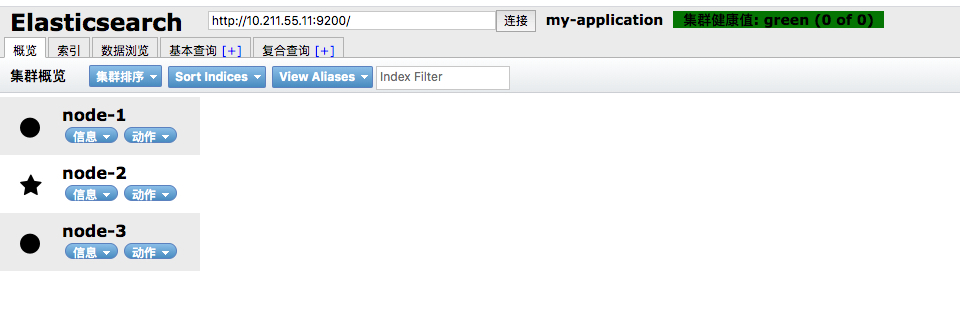
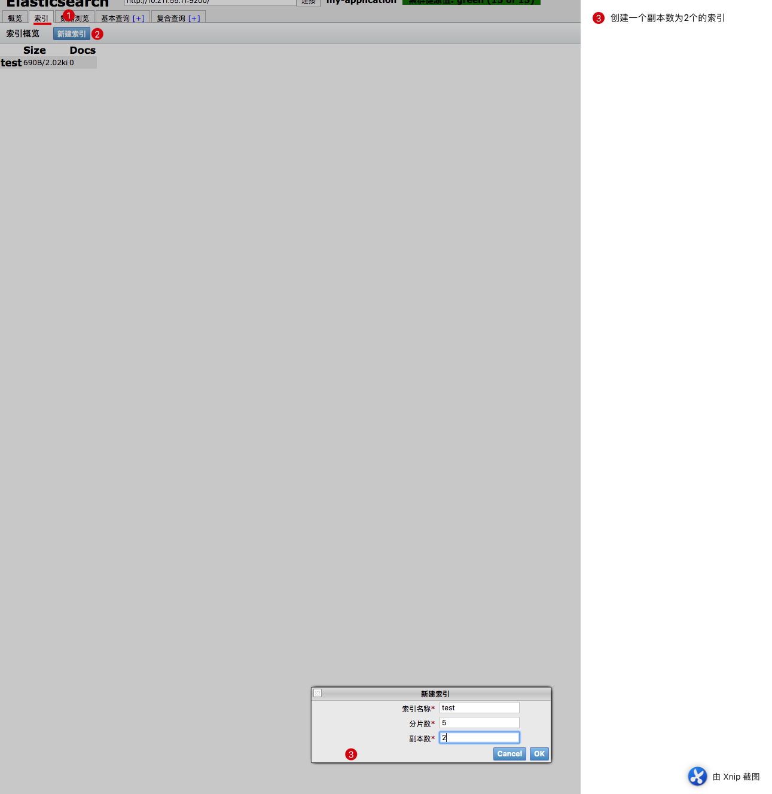
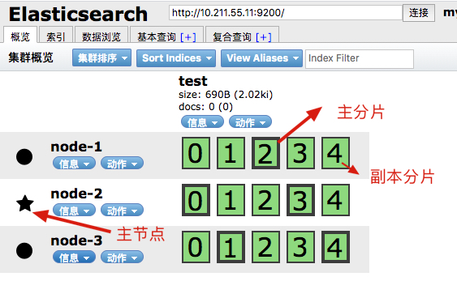
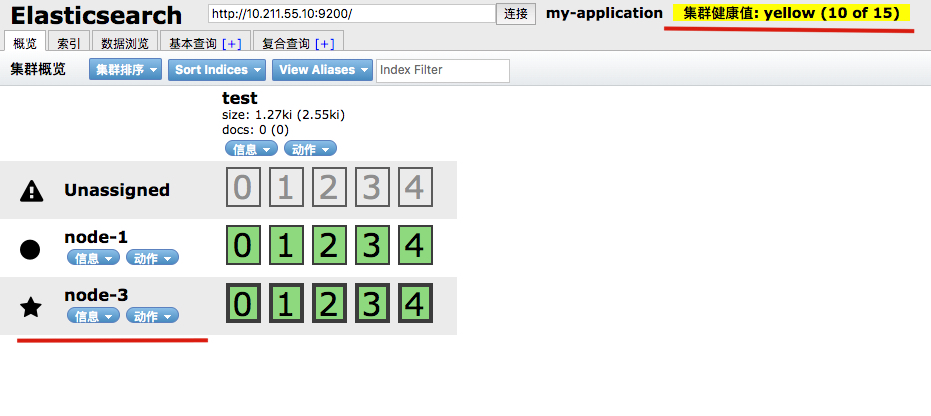
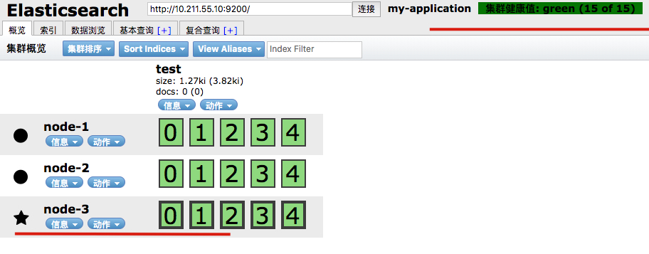

# 安装环境

首先我们准备三台机器

三台机器都配置好相应环境，首先保证每个机器都能正常运行es

可以参考我的这篇文章 [es配置和安装](https://github.com/leosanqing/food-shop/tree/master/3.0/blog/es/es%E5%AE%89%E8%A3%85%E5%92%8C%E9%85%8D%E7%BD%AE)


# 集群搭建

我们只需要更改其中一小部分配置就行

## 配置

```javascript
# cluster.name 这个属性 三个机器请务必保持一致
# node.name 三台机器要不一致 可以取名 node-1 ,node-2..

# 添加以下语句. 表明如果有MASTER 挂掉之后，他有可能成为 master节点。如果为false ，永远不可能成为master节点
node.master: true
node.data: true


# 根据自己的机器ip进行相应的更改  注意端口是9300，
discovery.zen.ping.unicast.hosts: ["10.211.55.10:9300","10.211.55.11:9300","10.211.55.12:9300"]
```


## 验证

启动之后，我们使用之前下载好的 elasticsearch-header 进行访问

我们看到他一共有三个节点，将上面的地址替换为其中的任意一个，都能返回三个节点，就可以了





我们创建一个索引 副本数为2的索引




其中：**五角星标志的是主节点，粗线矿的是主分片，细线框的是副本分片**。他们被均匀的分布在三个机器上




## 测试宕机

我们关掉其中的一台机器。我们看到原来的 **主节点**被停了，node3成了主节点，因为我们之前设置的时候，node1和node3的 node.master 属性是被设置成 true的，他就从其中的一个节点中选取主节点

我们看到右上角变黄了。原因是**至少一个副本分片出了问题**。绿色表示全部正常。红色表示，至少一个主分片除了问题




然后我们再把 node2起起来，右上角变绿了

并且 主节点还是 node-3. 对比我们之前搭建 LVS+Nginx集群 和 redis集群 宕机之后恢复。 Redis 和这个是类似的，如果主节点挂了之后，再恢复，他就变成副节点了

