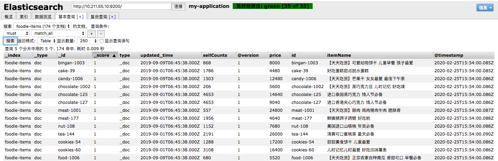
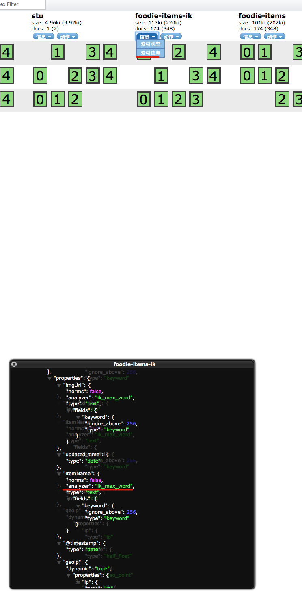

# 前言

我们已经配置好了 elasticsearch ，但是我们需要将数据库里面的信息采集到的es中，就需要用到 LogStash

如果使用日志搜集系统，一般也会使用 LogStash

# 下载

Logstash 国内从官网下载比较慢，这里有国内镜像下载链接，选择和自己ES版本相符的版本

[http://newbe.pro/Mirrors/Mirrors-Logstash/](http://newbe.pro/Mirrors/Mirrors-Logstash/)


数据库连接工具

Mysql-connector [https://dev.mysql.com/downloads/connector/j/5.1.html](https://dev.mysql.com/downloads/connector/j/5.1.html)

# 配置

- 解压 使用 `tar -zxvf {文件名}`

- 新建地址 进入解压之后的文件夹 `mkdir sync`。这个里面用来设置各种同步的配置

- 配置文件 我们再 sync 中，新建一个文件，复制一下内容 `vim logstash-db-sync.conf`

  ```java
  input {
  	jdbc {
  		# 设置 mysql/mariaDB 数据库 url 以及数据库名称
  		jdbc_connection_string => "jdbc:mysql://localhost:3306/foodie-shop-dev?useUnicode=true&characterEncoding=UTF-8&autoReconnect"
  		# 用户名 密码
  		jdbc_user => "root"
  		jdbc_password => "root"
  		# 数据库驱动所在位置， 可以是绝对路径，也可以是相对路径
  		jdbc_driver_library => "/opt/logstash/sync/mysql-connector-java-5.1.48.jar"
  		# 驱动类名
  		jdbc_driver_class => "com.mysql.jdbc.Driver"
  		# 开启分页
  		jdbc_paging_enabled => "true"
  		# 分页每页数量
  		jdbc_page_size => "10000"
  		# 执行的sql文件路径
  		statement_filepath => "/opt/logstash/sync/foodie-items.sql"
  		# 设置定时任务时间间隔 含义: 分、时、天、月、年
  		schedule => "* * * * *"
  		# 索引类型
  		type => "_doc"
  		# 是否开启记录上次追踪的结果，也就是上次更新的时间
  		use_column_value =>true
  		# 记录上一次追踪的结果值
  		last_run_metadata_path => "/opt/logstash/sync/track_time"
  		# 如果 use_column_value 为true，配置本参数，追踪的 column 名
  		tracking_column => "updated_time"
  		# tracking_column 字段的类型
  		tracking_column_type => "timestamp"
  		# 是否清楚 last_run_metadata_path 的记录，true则每次都从头开始查询所有
  		clean_run => false
  		# 数据库字段名称大写转小写
  		lowercase_column_names => false
  	}
  }
  
  
  output {
  	elasticsearch {
  		# es 的地址
  		hosts => ["10.211.55.10:9200","10.211.55.11:9200","10.211.55.12:9200"]
  		# 同步的索引名
  		index => "foodie-items"
  		# 设置 _docId和数据相同
  		document_id => "%{id}"
  	}
  	# 日志输出
  	stdout {
  		codec => json_lines
  	}
  }
  ```

  

- 编写 sql 文件 `vim foodie-items.sql`

  ```sql
  select
  		i.id as id,
  		i.item_name as itemName,
  		i.sell_counts as sellCounts,
  		ii.url as imgUrl,
  		tempSpec.price_discount as price,
  		i.updated_time as updated_time
  FROM
  		items as i
  left join
  		items_img as ii
  on
  		i.id = ii.item_id
  left join
  (
  		select item_id,min(price_discount) as price_discount
  		from
  		items_spec
  		group by
  		item_id
  )tempSpec
  on
  		i.id  = tempSpec.item_id
  where
  		ii.is_main = 1
  		and
  		i.updated_time >= :sql_last_value
  ```

  

- 把之前的数据库连接工具 解压缩 `unzip {包名}`,将其中的`mysql-connector-java-5.1.48.jar`文件复制到 sync 下

- 运行 LogStash `./logstash -f /opt/logstash/sync/logstash-db-sync.conf ` (后面带上LogStash的配置文件地址)

# 验证

我们去 elasticsearch-header 中查询我们的索引，发现数据已经同步到es中




# 中文分词

我们还需要将文字进行中文分词

## 配置

1. 新建配置文件，在 sync 目录下 `vim logstash-ik.json`

   ```json
   {
       
           "order": 0,
           "version": 1,
           "index_patterns": ["*"],
           "settings": {
               "index": {
                   "refresh_interval": "5s"
               }
           },
           "mappings": {
               "_default_": {
                   "dynamic_templates": [
                       {
                           "message_field": {
                               "path_match": "message",
                               "match_mapping_type": "string",
                               "mapping": {
                                   "type": "text",
                                   "norms": false
                               }
                           }
                       },
                       {
                           "string_fields": {
                               "match": "*",
                               "match_mapping_type": "string",
                               "mapping": {
                                   "type": "text",
                                   "norms": false,
                                   "analyzer": "ik_max_word",
                                   "fields": {
                                       "keyword": {
                                           "type": "keyword",
                                           "ignore_above": 256
                                       }
                                   }
                               }
                           }
                       }
                   ],
                   "properties": {
                       "@timestamp": {
                           "type": "date"
                       },
                       "@version": {
                           "type": "keyword"
                       },
                       "geoip": {
                           "dynamic": true,
                           "properties": {
                               "ip": {
                                   "type": "ip"
                               },
                               "location": {
                                   "type": "geo_point"
                               },
                               "latitude": {
                                   "type": "half_float"
                               },
                               "longitude": {
                                   "type": "half_float"
                               }
                           }
                       }
                   }
               }
           },
           "aliases": {}
       
   }
   ```

   

2. 编辑之前的 配置文件`logstash-db-sync.conf`,在`output`中添加如下内容

   ```javascript
   		# 定义模板名称 
   		template_name => "myik"
   		# 模板所在位置 根据自己的环境进行更改
   		template => "/opt/logstash/sync/logstash-ik.json"
   		#重写模板
   		template_overwrite => true
   		# 默认为true， false 关闭 LogStash 自动管理模板功能，如果自定义模板，则设置为false
   		manage_template => false
   ```

   

3. 请一定确保你的 ES 之前已经安装过 中文分词器 ik 插件。不知道的可以看我之前 [ES安装配置](https://github.com/leosanqing/food-shop/tree/master/3.0/blog/es/es%E5%AE%89%E8%A3%85%E5%92%8C%E9%85%8D%E7%BD%AE)

## 验证

当我们启动同步之后，可以再去 elasticsearch-header 中查看信息，字段中有 analyzer 并且是 ik字样那就是配置成功了

