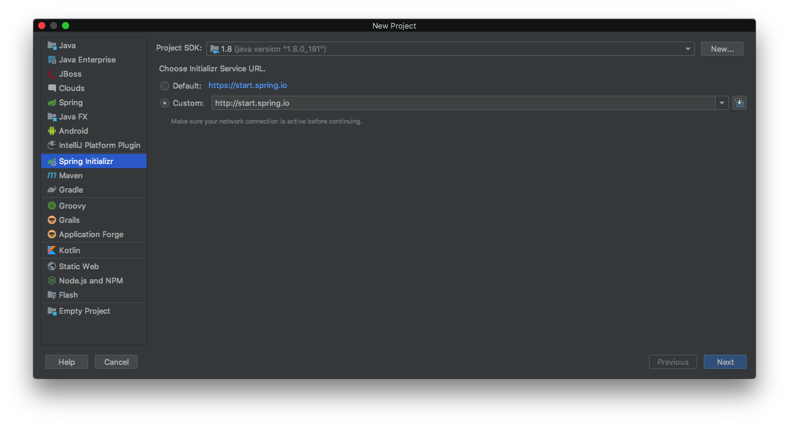
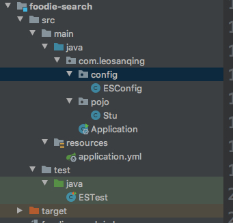
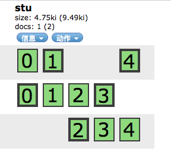
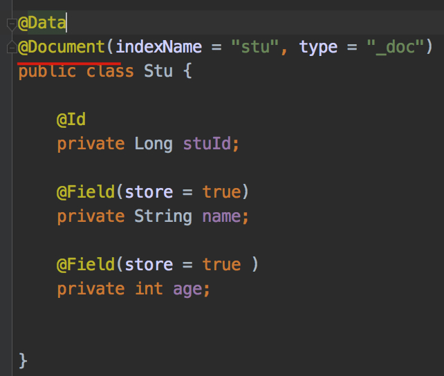
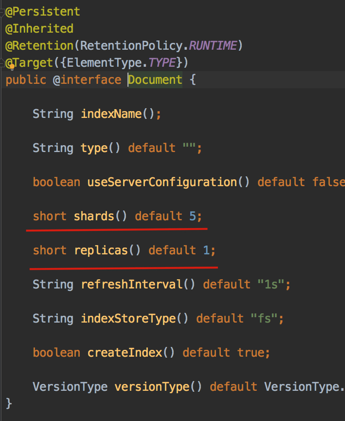

# 前言

我们已经安装和配置好了ES。

如果不知道怎么配置，可以先按照我的这篇文章进行安装和配置 [ES安装和配置](https://github.com/leosanqing/food-shop/tree/master/3.0/blog/es/es%E5%AE%89%E8%A3%85%E5%92%8C%E9%85%8D%E7%BD%AE)

如果要搭建集群，可以参考我这篇文章 [ES集群搭建](https://github.com/leosanqing/food-shop/tree/master/3.0/blog/es/es%E9%9B%86%E7%BE%A4%E6%90%AD%E5%BB%BA)

这篇文章主要讲 springboot 怎么整合ES

# 新建项目

我们创建一个maven项目，可以使用spring的脚手架创建



然后pom文件中引入相关依赖

```xml
    <dependencies>
        <dependency>
            <groupId>org.springframework.boot</groupId>
            <artifactId>spring-boot-starter-data-elasticsearch</artifactId>
        </dependency>

        <dependency>
            <groupId>org.springframework.boot</groupId>
            <artifactId>spring-boot-starter-test</artifactId>
            <scope>test</scope>
        </dependency>
    </dependencies>

```

# 项目结构




## 实体类

我们新建一个实体类Stu,(如果没有 lombok 插件，去掉@Data注解，再引入get/set方法就行)

```java
package com.leosanqing.pojo;

import lombok.Data;
import org.springframework.data.annotation.Id;
import org.springframework.data.elasticsearch.annotations.Document;
import org.springframework.data.elasticsearch.annotations.Field;

/**
 * @Author: leosanqing
 * @Date: 2020/3/3 下午11:39
 * @Package: com.leosanqing.pojo
 * @Description: 学生类
 */

@Data
@Document(indexName = "stu", type = "_doc")
public class Stu {

    @Id
    private Long stuId;

    @Field(store = true)
    private String name;

    @Field(store = true )
    private int age;


}

```

## 配置文件

在 application.yml 中添加配置

```javascript
spring:
  data:
    elasticsearch:
      cluster-name: my-application
      cluster-nodes: 10.211.55.10:9300,10.211.55.11:9300,10.211.55.12:9300
 
```

## 配置类

新建配置类 ,如果没有这个配置类，启动会报错(可以自行试验)

```java
package com.leosanqing.config;

import org.springframework.context.annotation.Configuration;

import javax.annotation.PostConstruct;

/**
 * @Author: leosanqing
 * @Date: 2020/3/3 下午11:26
 * @Package: com.leosanqing.config
 * @Description: ES 的配置类
 */

@Configuration
public class ESConfig {

    @PostConstruct
    public void init(){
        System.setProperty("es.set.netty.runtime.available.processors", "false");
    }
}

```


## 测试类

然后我们在test中，新建一个 测试类


```java
import com.leosanqing.Application;
import com.leosanqing.pojo.Stu;
import org.junit.Test;
import org.junit.runner.RunWith;
import org.springframework.beans.factory.annotation.Autowired;
import org.springframework.boot.test.context.SpringBootTest;
import org.springframework.data.elasticsearch.core.ElasticsearchTemplate;
import org.springframework.data.elasticsearch.core.query.IndexQuery;
import org.springframework.data.elasticsearch.core.query.IndexQueryBuilder;
import org.springframework.test.context.junit4.SpringRunner;

/**
 * @Author: leosanqing
 * @Date: 2020/3/3 下午11:37
 * @Package: PACKAGE_NAME
 * @Description: ES 测试类
 */
@RunWith(SpringRunner.class)
@SpringBootTest(classes = Application.class)
public class ESTest {
    @Autowired
    private ElasticsearchTemplate template;

    @Test
    public void createIndex() {
        Stu stu = new Stu();
        stu.setStuId(10000L);
        stu.setAge(18);
        stu.setName("leosanqing");

        IndexQuery indexQuery = new IndexQueryBuilder().withObject(stu).build();

        template.index(indexQuery);
    }
}

```


# 验证

运行测试类之后，看有没有出错，如果是绿的，再去我们之前的 elasticsearch-header中查看。已经 创建了一个新的索引




我们看到这个索引，有5个主分片，每个主分片有一个副分片。这个是在他的默认配置里面，可以按照需求进行更改



