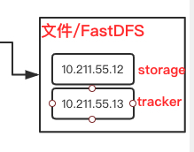
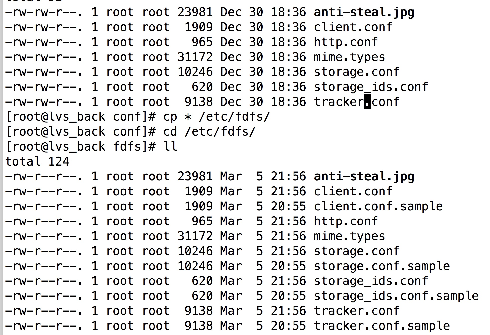
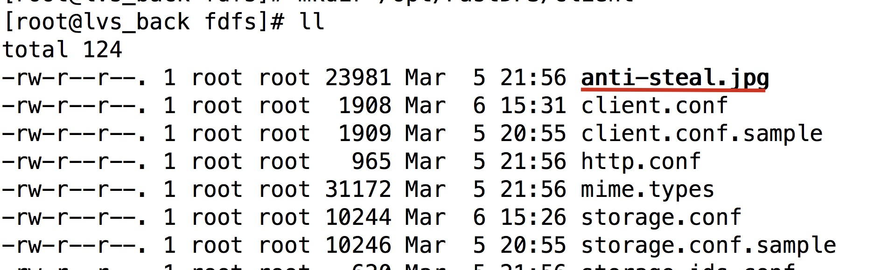
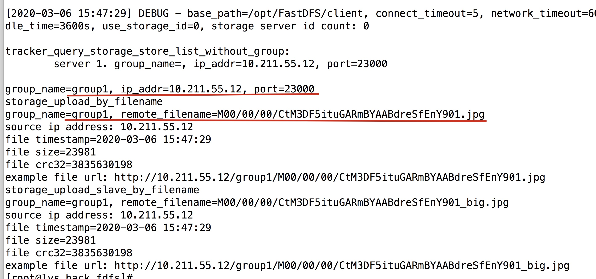
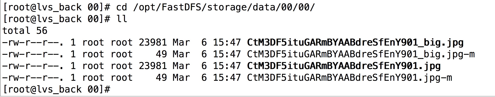
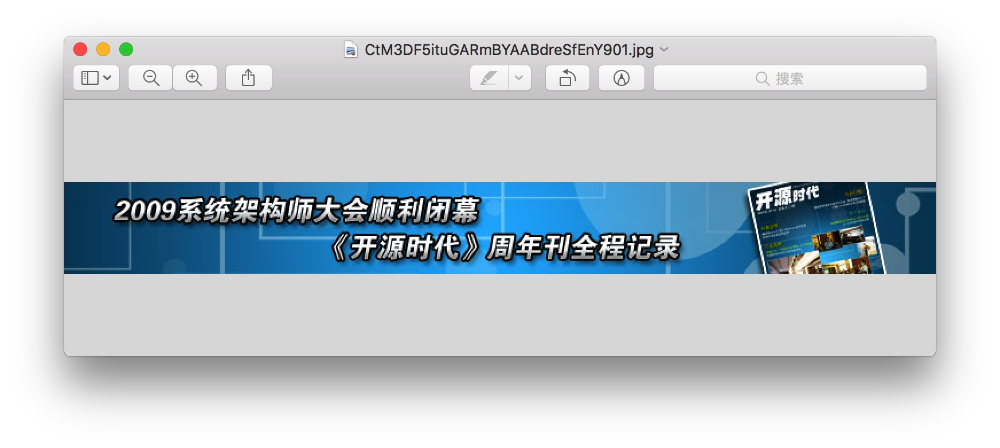

# 前言

我们要升级我们的文件存储系统


我们需要准备两个机器 一台作为 storage 一台作为 tracker,

当然如果没有额外的虚拟机,全部在一台上也是可以的



# 下载

1. fastdfs
2. Fastdfs-nginx-module
3. libfastcommon
4. Nginx

# 安装

## 环境配置

1. 安装 c语言环境 `yum install -y gcc gcc-c++`
2. 安装 libevent `yum -y install libevent`

## 安装

1. 解压 `libfastcommon`,`tar -zxvf {包名}` 
2. 进入 文件夹  `./make.sh`
3. 安装 `./make.sh install`
4. 安装 fastdfs 。重复上述步骤

## 复制配置文件

进入 fastdfs文件夹下的 conf 文件夹. 拷贝配置文件 `cp * /etc/fdfs/`



## 修改配置文件

### 当 tracker 的机器

修改配置文件  `vim /etc/fdfs/tracker.conf`

```javascript
# the base path to store data and log files
# 你也可以不修改，不过改了之后知道自己数据存放在哪里
base_path = /opt/FastDFS/tracker
```

### 当 storage 的机器

修改配置文件 `vim /etc/fdfs/storage.conf`

```javascript
# 可以不改
base_path = /opt/FastDFS/storage
store_path0 = /opt/FastDFS/storage

# 这个改成我们 tracker的地址
tracker_server = 10.211.55.13:22122
```

## 启动机器

先启动 tracker

`/usr/bin/fdfs_trackerd /etc/fdfs/tracker.conf`

再启动 storage

`/usr/bin/fdfs_storaged /etc/fdfs/storage.conf`


# 验证

我们 切换至 storage 机器

我们用他的客户端测试

1. 修改配置文件`vim /etc/fdfs/client.conf`

   ```javascript
   # 把路径改了 
   base_path = /opt/FastDFS/client
   
   # 把tracker的ip改了
   tracker_server = 10.211.55.13:22122 
   ```

2. 新建文件夹  `mkdir /opt/FastDFS/client`

3. 我们把 `/etc/fdfs`文件夹下的 这个文件上传

   `/usr/bin/fdfs_test /etc/fdfs/client.conf upload anti-steal.jpg`

   

4. 可能遇到的错误

   ` ERROR - file: connection_pool.c, line: 142, connect to server 10.211.55.13:22122 fail, errno: 113, error info: No route to host`

   由于 tracker的防火墙没有关闭 

   切换至 tracker机器输入 `systemctl stop firewalld.service`

5. 再重新运行上面的命令

   

6. 我们访问下 上面的地址 访问storage 机器`cd /opt/FastDFS/storage/data/00/00/`

   

7. 我们现在不能使用 浏览器查看 ，需要配置好 Nginx只有，先使用  filezilla 下载下来查看 

   

8. 说明我们 FastDFS已经配置好了


# 安装 nginx 模块


1. 解压之前下载的 Nginx模块压缩包 `tar -zxvf {文件名}`

2. 进入src文件夹后，修改 config文件  

   ```javascript
   # 删掉local 
   ngx_module_incs="/usr/include"
   CORE_INCS="$CORE_INCS /usr/include"
   ```

3. 拷贝配置文件 ,便于管理`cp mod_fastdfs.conf /etc/fdfs/`

4. 安装Nginx，安装步骤请看 [https://github.com/leosanqing/food-shop/tree/master/2.0/blog/nginx%E5%AE%89%E8%A3%85](https://github.com/leosanqing/food-shop/tree/master/2.0/blog/nginx安装)我们有一个地方需要注意,和之前的Nginx安装有点不一样。最后一处(注意改成自己的路径)

   我们需要把FastDFS相关的模块添加上

   ```javascript
   ./configure \
   --prefix=/opt/nginxNew \
   --pid-path=/var/run/nginx/nginx.pid \
   --lock-path=/var/lock/nginx.lock \
   --error-log-path=/var/log/nginx/error.log \
   --http-log-path=/var/log/nginx/access.log \
   --with-http_gzip_static_module \
   --http-client-body-temp-path=/var/temp/nginx/client \
   --http-proxy-temp-path=/var/temp/nginx/proxy \
   --http-fastcgi-temp-path=/var/temp/nginx/fastcgi \
   --http-uwsgi-temp-path=/var/temp/nginx/uwsgi \
   --http-scgi-temp-path=/var/temp/nginx/scgi \
   --add-module=/opt/FastDFS/fastdfs-nginx-module-1.22/src
   ```

   如果之前安装过了Nginx，但是没有添加这个模块，可以参考这个博文 [Nginx如何添加新模块](https://blog.csdn.net/weixin_42313749/article/details/100167154?depth_1-utm_source=distribute.pc_relevant.none-task&utm_source=distribute.pc_relevant.none-task)

5. 修改配置文件  `vim /etc/fdfs/mod_fastdfs.conf`

   ```javascript
   base_path=/opt/FastDFS/tmp
   tracker_server=10.211.55.13:22122
   # 如果你之前改过的话
   group_name=group1
   url_have_group_name = true
   # 这个路径和存储路径一致
   store_path0=/opt/FastDFS/storage
   ```

   

6. 新建 路径 `/opt/FastDFS/tmp` (如果没有会报错，他不会报错，只是访问不了nginx，我被这个坑死了)

7. 修改Nginx的配置文件 `vim /opt/nginxNew/conf/nginx.conf`

   ```javascript
   server {
     			# 注意这个端口要和我们之前配置的端口一致，如果你没有改过，默认是8888
           listen       8888;
           server_name  localhost;
   
           #charset koi8-r;
   
           #access_log  logs/host.access.log  main;
   
           location ~/group[0-9]/ {
                   ngx_fastdfs_module;
           }
   }
   ```

   

8. 然后启动 nginx

# 验证

我们访问 Nginx的路径，把之前的图片路径输进去 `http://10.211.55.12:8888/group1/M00/00/00/CtM3DF5ituGARmBYAABdreSfEnY901.jpg`

然后能成功 返回图片 就成功了


# 问题排查

1. Nginx无法访问，查看防火墙是否关闭。关闭防火墙命令 `systemctl stop firewalld.service`
2. 看所有参数是否设置正确
3. 访问 Nginx的日志  `vim /var/temp/nginx/error.log`。我的问题是在这里发现的。他出问题不会报错，一切正常，但就是访问不了。坑了我半天