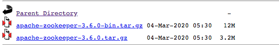
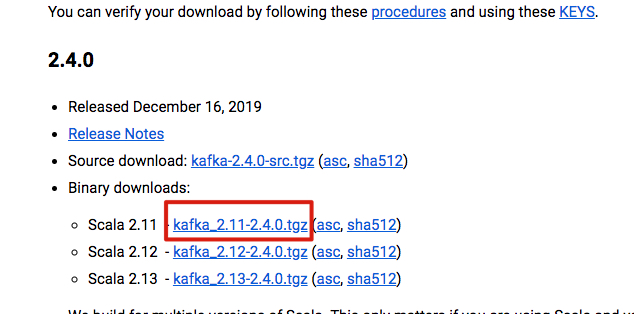
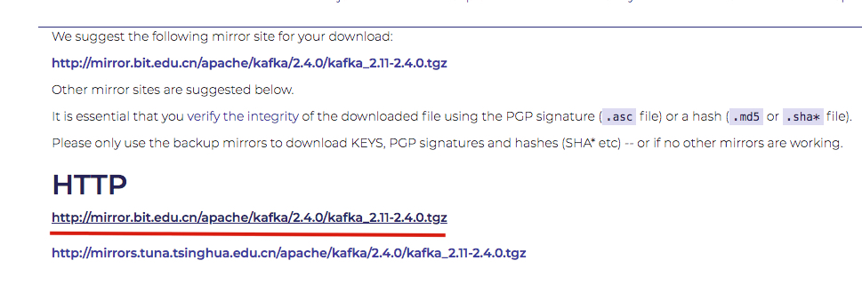
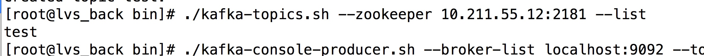
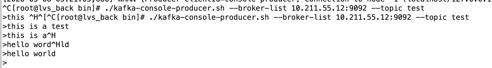
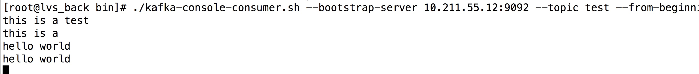

# 前言

随着项目业务的增长，我们可能有海量日志，不管是新增还是查询，如果只是用原来的方法，肯定是行不通的

因此我们用业界最常用的 kafka +ELK 进行日志 的搜集

# 安装

## Zookeeper配置

kafka安装需要依赖 JDK 和 Zookeeper 环境

所以我们先安装 Zookeeper

请注意，我们去下载的一定要是  有bin的这个包，不要下载后面那个，不然后面会报错



[http://mirror.bit.edu.cn/apache/zookeeper/](http://mirror.bit.edu.cn/apache/zookeeper/)

[Zookeeper安装和配置](https://juejin.im/post/5abc984c51882555635e66ef)

## 下载

Kafka 下载地址 [http://kafka.apache.org/downloads.html](http://kafka.apache.org/downloads.html)





1. 我是把软件放在 `/opt`目录下，解压 `tar -zxvf kafka_2.11-2.4.0.tgz`

2. 重命名 `mv kafka_2.11-2.4.0 kafka`

3. 修改配置文件  `vim kafka_2.11-2.4.0/config/server.properties`

   ```javascript
   broker.id=0
   port=9092
   
   # 改成自己的端口和配置
   listeners=PLAINTEXT://10.211.55.12:9092
   #advertised.listeners=PLAINTEXT://your.host.name:9092
   advertised.listeners=PLAINTEXT://10.211.55.12:9092
   
   
   # 可以改成自己的路径
   log.dirs=/opt/kafka/logs
   num.partitions=2
   # 改成自己之前的 Zookeeper 地址和端口
   zookeeper.connect=10.211.55.11:2181,10.211.55.12:2181,10.211.55.13:2181
   
   ```

   

4. 如果前面改了log的目录，创建目录 `mkdir /opt/kafka/logs`

## 启动

启动之前一定要先启动 Zookeeper

`/opt/kafka/bin.kafka-server-start.sh /opt/kafka/config/server.properties`

# 简单操作

## 创建topic

在 kafka 的 bin 目录下 ，

```javascript
## 请根据自己的情况进行更改  test 是topic的名字 创建名为test的topic， 1个分区分别存放数据，数据备份总共1份
##--zookeeper 为zk服务列表
## --create 命令后 --topic 为创建topic 并指定 topic name
## --partitions 为指定分区数量
## --replication-factor 为指定副本集数量


./kafka-topics.sh --zookeeper 10.211.55.12:2181 --create --topic test --partitions 1 --replication-factor 1
```


## 查看topic 列表

```JavaScript
# 查看topic列表命令： 上面 Zookeeper的地址
./kafka-topics.sh --zookeeper 10.211.55.12:2181 --list
```



## 生产者发送数据

```JavaScript
./kafka-console-producer.sh --broker-list 10.211.55.12:9092 --topic test
```



## 消费者接受数据

```JavaScript
./kafka-console-consumer.sh --bootstrap-server 10.211.55.12:9092 --topic test --from-beginning
```



