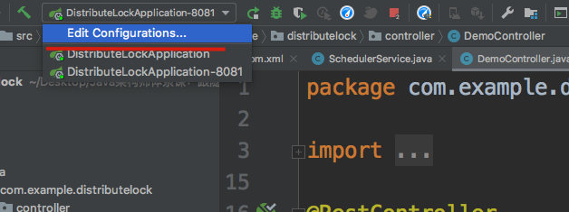
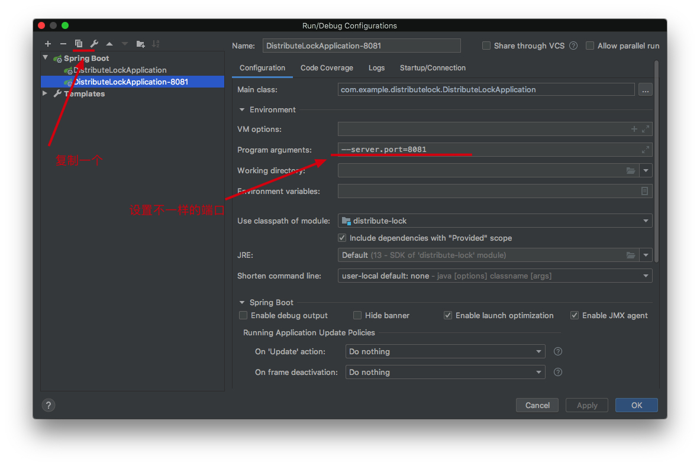
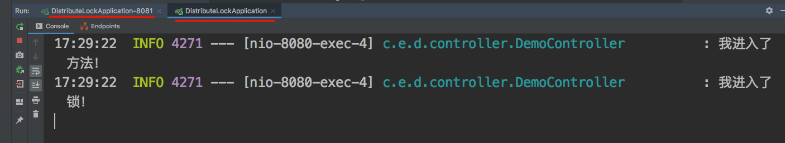
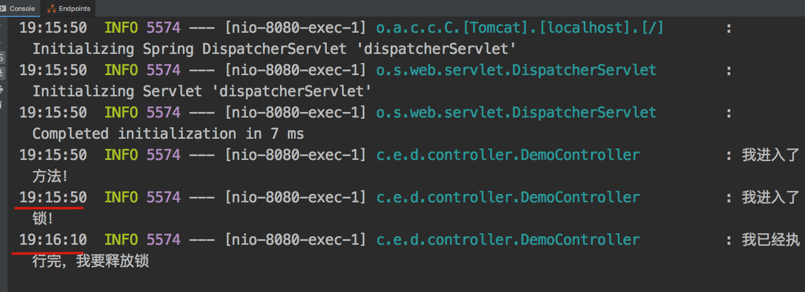
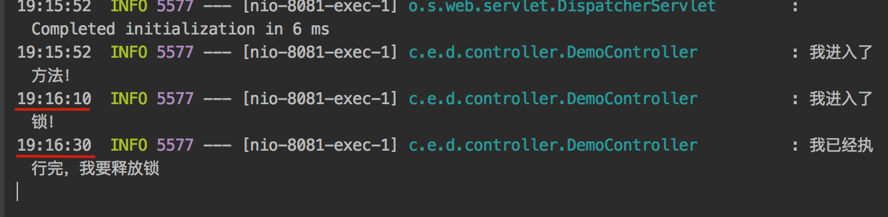
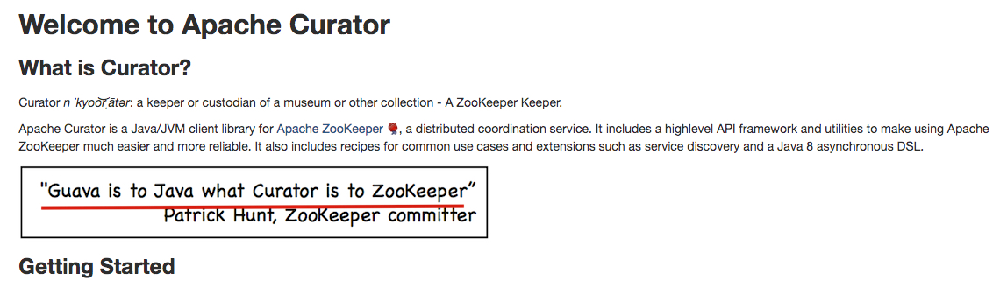

# 前言

我们在上一节使用了单体锁-synchronized 和 ReentrantLock 解决了 超卖的现象，但是由于它是单体锁，我们在分布式的环境下就无法保证数据的准确性。

我们这节就用讲下分布式的情况下我们怎么使用分布式锁来保证高并发下的数据一致性

这个项目对应的是  **distribute-lock**


# 怎么启动两个程序

1. 复制一个项目
2. 设置不同的端口
3. 依次启动






# 单体锁的局限性

我们先用程序模拟下单体锁在分布式项目下的问题

项目代码

```java

    /**
     * 单体锁
     * @return
     * @throws Exception
     */
    @RequestMapping("singleLock")
    @Transactional(rollbackFor = Exception.class)
    public  String singleLock() throws Exception {
        log.info("我进入了方法！");
        synchronized (this) {
            log.info("我进入了锁！");
            try {
                Thread.sleep(20000);
            } catch (InterruptedException e) {
                e.printStackTrace();
            }
        }

        return "我已经执行完成！";
    }

```

我们分别访问 这两个方法

我们发现，他并没有锁住相应的语句，正常一个应该只能进入方法，因为另一个没有执行完，他无法获取锁。这就是单体锁的局限性



# 数据库锁

select ... for update

简单的说就是 如果不 commit，那么后面sql访问同一条数据，上述语句都无法进行提交，都被阻塞

我们用程序来验证一下，我们让他执行20s之后结束，再释放锁

```java
/**
 * dbDisLock
 * @return
 * @throws Exception
 */
@RequestMapping("dbDisLock")
@Transactional(rollbackFor = Exception.class)
public String dbDisLock() throws Exception {
    log.info("我进入了方法！");
    DistributeLock distributeLock = distributeLockMapper.selectDistributeLock("demo");
    if (distributeLock==null) throw new Exception("分布式锁找不到");
    log.info("我进入了锁！");
    try {
        Thread.sleep(20000);
    } catch (InterruptedException e) {
        e.printStackTrace();
    }
    log.info("我已经执行完，我要释放锁");
    return "我已经执行完成！";
}
```

 这个是 上面执行的 sql 语句

```xml
<select id="selectDistributeLock" resultType="com.example.distributelock.model.DistributeLock">
  select * from distribute_lock
  where business_code = #{businessCode,jdbcType=VARCHAR}
  for update
</select>
```


我们来看结果





我们看到 8081 的这个程序 是在 8080这个 程序执行完之后才进入的锁，所以这个已经达到了我们的目的。

# Redis

我们很多都听过 Redis的 setnx ，这个也是很多分布式锁都会采取的方式

为什么呢？主要是利用Redis 处理时只有一个线程。(redis 单线程指的是网络请求模块使用了一个线程，即一个线程处理所有网络请求，其他模块仍用了多个线程。)所以我们很多个请求到达redis之后就被串行执行了


```java
/**
 * 获取分布式锁
 * @return
 */
public boolean getLock(){
    RedisCallback<Boolean> redisCallback = connection -> {
        //设置NX
        RedisStringCommands.SetOption setOption = RedisStringCommands.SetOption.ifAbsent();
        //设置过期时间
        Expiration expiration = Expiration.seconds(expireTime);
        //序列化key
        byte[] redisKey = redisTemplate.getKeySerializer().serialize(key);
        //序列化value
        byte[] redisValue = redisTemplate.getValueSerializer().serialize(value);
        //执行setnx操作
        Boolean result = connection.set(redisKey, redisValue, expiration, setOption);
        return result;
    };

    //获取分布式锁
    Boolean lock = (Boolean)redisTemplate.execute(redisCallback);
    return lock;
}
```

```java
    /**
     * 释放锁
     * @return
     */
    public boolean unLock() {
        // 使用 lua 脚本校验是否是之前自己加的锁
        String script = "if redis.call(\"get\",KEYS[1]) == ARGV[1] then\n" +
                "    return redis.call(\"del\",KEYS[1])\n" +
                "else\n" +
                "    return 0\n" +
                "end";
        RedisScript<Boolean> redisScript = RedisScript.of(script,Boolean.class);
        List<String> keys = Arrays.asList(key);

        return (Boolean)redisTemplate.execute(redisScript, keys, value);
    }
```

为啥在释放锁的时候需要使用 上面的 lua 脚本呢？ 主要是我们需要校验一下 这个锁是不是我们之前加的，如果不是你加的锁，或者你加的锁失效了，现在是另一个线程加的锁，那你释放了是不是就释放错了？

# Zookeeper

我们也可以使用 Zookeeper 的瞬时节点来进行分布式锁，如果有很多应用同时创建瞬时节点，他会顺序的创建相应的节点。然后按照顺序对之前的请求进行处理，不是当前的那就进行等待

当一个业务处理完成之后，他就会删除当前的瞬时节点。然后我们的观察器就能收到相应的信息，再唤醒下一个节点。处理相应的请求，以此类推

不过在这之前，我们需要先安装ZK。可以参考这篇文章 [Zookeeper安装和配置](https://juejin.im/post/5abc984c51882555635e66ef)

```java
public class ZkLock implements Watcher,AutoCloseable {

    private ZooKeeper zooKeeper;
    private String businessName;
    private String znode;

    public ZkLock(String connectString,String businessName) throws IOException {
        this.zooKeeper = new ZooKeeper(connectString,30000,this);
        this.businessName = businessName;
    }

    public boolean getLock() throws KeeperException, InterruptedException {

        // 判断是否有业务的根节点
        Stat existsNode = zooKeeper.exists("/" + businessName, false);
        if (existsNode == null){
            // 根节点是永久的节点
            zooKeeper.create("/" + businessName,businessName.getBytes(),
                    ZooDefs.Ids.OPEN_ACL_UNSAFE,
                    CreateMode.PERSISTENT);
        }

        znode = zooKeeper.create("/" + businessName + "/" + businessName + "_", businessName.getBytes(),
                ZooDefs.Ids.OPEN_ACL_UNSAFE,
                CreateMode.EPHEMERAL_SEQUENTIAL);
        znode = znode.substring(znode.lastIndexOf("/")+1);

        // 获取所有的子节点
        List<String> childrenNodes = zooKeeper.getChildren("/" + businessName, false);
        Collections.sort(childrenNodes);


        String firstNode = childrenNodes.get(0);
        if (!firstNode.equals(znode)){
            String lastNode = firstNode;
            for (String node:childrenNodes){
                if (!znode.equals(node)){
                    lastNode = node;
                }else {
                    // 监听上一个节点
                    zooKeeper.exists("/"+businessName+"/"+lastNode,true);
                    break;
                }
            }
            synchronized (this){
                wait();
            }
        }
        return true;
    }

    @Override
    public void process(WatchedEvent watchedEvent) {
      	// 上一个节点释放锁之后，唤醒下一个节点进行处理
        if (watchedEvent.getType() == Event.EventType.NodeDeleted){
            synchronized (this){
                notify();
            }
        }
    }


    @Override
    public void close() throws Exception {
        zooKeeper.delete("/"+businessName+"/"+znode,-1);
        zooKeeper.close();
        log.info("我释放了锁");
    }
}
```

# Curator

Curator 是什么呢？我们先看下他的评价



可见 对 Curator 的评价之高

Curator 是 Apache Zookeeper 的一个客户端库，让我们可以更加简单的使用 Zookeeper。

到底可以多简单呢？ 我们用它实现分布式锁，对比之前我们使用 Zookeeper 实现分布式锁

```java
public String curatorLock(){
    log.info("我进入了方法！");
    InterProcessMutex lock = new InterProcessMutex(client, "/order");
    try{
        if (lock.acquire(30, TimeUnit.SECONDS)){
            log.info("我获得了锁！！");
            Thread.sleep(10000);
        }
    } catch (Exception e) {
        e.printStackTrace();
    } finally {
        try {
            log.info("我释放了锁！！");
            lock.release();
        } catch (Exception e) {
            e.printStackTrace();
        }
    }
    log.info("方法执行完成！");
    return "方法执行完成！";
}
```

我们只要 new 一个 lock 实例，传入相关参数，然后编辑自己的相关业务就好。不需要像之前我们直接使用 Zookeeper 一样，还需要自己实现 分布式锁的逻辑。

# Redisson

Redisson 和 Curator 类似，都是提供的一个工具类，是别人封装好的工具，直接调用就行，使用起来也很简单

```java
@RestController
@Slf4j
public class RedissonLockController {
    @Autowired
    private RedissonClient redisson;

    @RequestMapping("redissonLock")
    public String redissonLock() {
        RLock rLock = redisson.getLock("order");
        log.info("我进入了方法！！");
        try {
            rLock.lock(30, TimeUnit.SECONDS);
            log.info("我获得了锁！！！");
            Thread.sleep(10000);
        } catch (InterruptedException e) {
            e.printStackTrace();
        }finally {
            log.info("我释放了锁！！");
            rLock.unlock();
        }
        log.info("方法执行完成！！");
        return "方法执行完成！！";
    }
}
```

# 优缺点

|                |             优点             |                             缺点                             |
| :------------: | :--------------------------: | :----------------------------------------------------------: |
| 数据库分布式锁 | 简单方便、易于理解、易于操作 | 并发量大的时候，对数据库压力较大。最好将作为锁的数据库和业务数据库分开，这样当作为锁的数据库阻塞，不影响业务数据库 |
|  redis setnx   |           易于理解           |            需要自己实现逻辑，可能有bug。不能阻塞             |
|   Zookeeper    |            可阻塞            |       需要自己实现逻辑，可能有bug。逻辑复杂。强一致性        |
|    Curator     |       简单方便、可阻塞       |             强一致性。集群环境下需要同步所有节点             |
|    Redisson    |       简单方便、可阻塞       |                                                              |

如果程序中实现，最好使用 Curator 和 Redisson 毕竟是大佬们写的，并且经过大量公司测试过得，稳定和性能肯定比自己写的好