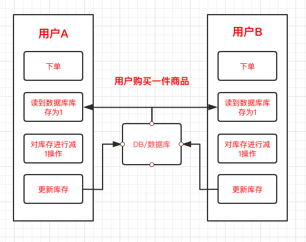
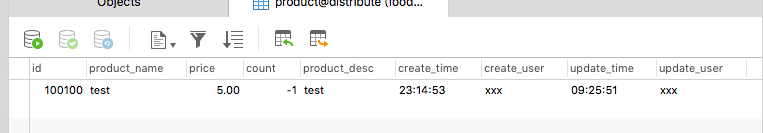
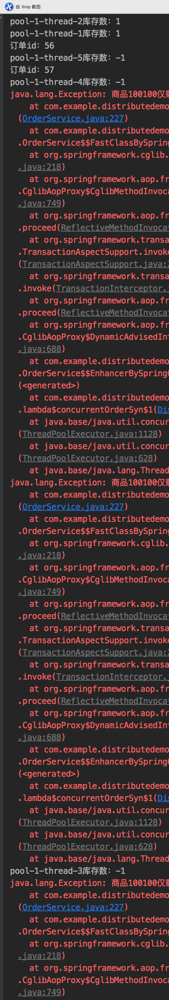

# 前言

我们已经知道了 超卖的现象，那么超卖是怎么产生的呢？

# 原因

我们看代码，一开始的新手程序员可能都会这样写

```java
/**
 * 在程序里面写扣减语句
 * @return
 * @throws Exception
 */
@Transactional(rollbackFor = Exception.class)
public Integer createOrderNormal() throws Exception {
    Product product = productMapper.selectByPrimaryKey(purchaseProductId);

    if (product == null) {

        throw new Exception("购买商品：" + purchaseProductId + "不存在");
    }


    //商品当前库存
    Integer currentCount = product.getCount();
    System.out.println(Thread.currentThread().getName() + "库存数：" + currentCount);
    //校验库存
    if (purchaseProductNum > currentCount) {
        throw
                new Exception("商品" + purchaseProductId + "仅剩" + currentCount + "件，无法购买");
    }


    Integer leftCount = currentCount - purchaseProductNum;
    // 更新库存
    product.setCount(leftCount);
    product.setUpdateTime(new Date());
    product.setUpdateUser("xxx");
    productMapper.updateByPrimaryKeySelective(product);


    Order order = new Order();
    order.setOrderAmount(product.getPrice().multiply(new BigDecimal(purchaseProductNum)));
    order.setOrderStatus(1);//待处理
    order.setReceiverName("xxx");
    order.setReceiverMobile("13311112222");
    order.setCreateTime(new Date());
    order.setCreateUser("xxx");
    order.setUpdateTime(new Date());
    order.setUpdateUser("xxx");
    orderMapper.insertSelective(order);

    OrderItem orderItem = new OrderItem();
    orderItem.setOrderId(order.getId());
    orderItem.setProductId(product.getId());
    orderItem.setPurchasePrice(product.getPrice());
    orderItem.setPurchaseNum(purchaseProductNum);
    orderItem.setCreateUser("xxx");
    orderItem.setCreateTime(new Date());
    orderItem.setUpdateTime(new Date());
    orderItem.setUpdateUser("xxx");
    orderItemMapper.insertSelective(orderItem);
    return order.getId();
}
```

我们注意 更新库存的那部分语句，我们在程序中进行库存的扣减逻辑，然后再更新回数据库。那这个会有什么问题呢？

我们看下下单的操作



如果两个用户同时下单，同时走到 读取数据库库存的步骤，然后再进行扣减，按照上面的程序逻辑，我们就会出现多个订单的现象。

那么我们如何避免这种现象呢？

**我们可以使用 数据库的行锁**


# 行锁

我们利用数据库行锁的特性，把扣除库存的逻辑交给数据库来进行，这样就能避免上面的情况

我们删掉程序中的扣除库存的逻辑，再编写新的sql

```java
@Transactional(rollbackFor = Exception.class)
public Integer createOrder1() throws Exception {
    Product product = productMapper.selectByPrimaryKey(purchaseProductId);
    if (product == null) {
        throw new Exception("购买商品：" + purchaseProductId + "不存在");
    }


    //商品当前库存
    Integer currentCount = product.getCount();
    System.out.println(Thread.currentThread().getName() + "库存数：" + currentCount);
    //校验库存
    if (purchaseProductNum > currentCount) {
        throw
                new Exception("商品" + purchaseProductId + "仅剩" + currentCount + "件，无法购买");
    }

    productMapper.updateProductCount(purchaseProductNum, "xxx", new Date(), product.getId());


    Order order = new Order();
    order.setOrderAmount(product.getPrice().multiply(new BigDecimal(purchaseProductNum)));
    order.setOrderStatus(1);//待处理
    order.setReceiverName("xxx");
    order.setReceiverMobile("13311112222");
    order.setCreateTime(new Date());
    order.setCreateUser("xxx");
    order.setUpdateTime(new Date());
    order.setUpdateUser("xxx");
    orderMapper.insertSelective(order);

    OrderItem orderItem = new OrderItem();
    orderItem.setOrderId(order.getId());
    orderItem.setProductId(product.getId());
    orderItem.setPurchasePrice(product.getPrice());
    orderItem.setPurchaseNum(purchaseProductNum);
    orderItem.setCreateUser("xxx");
    orderItem.setCreateTime(new Date());
    orderItem.setUpdateTime(new Date());
    orderItem.setUpdateUser("xxx");
    orderItemMapper.insertSelective(orderItem);
    return order.getId();
}
```


```xml
<update id="updateProductCount">
  update product
  set count = count - #{purchaseProductNum,jdbcType=INTEGER},
    update_user = #{updateUser,jdbcType=VARCHAR},
    update_time = #{updateTime,jdbcType=TIME}
  where id = #{id,jdbcType=INTEGER}
</update>
```


那么上面的会防住 高并发下的超卖现象吗？ **答案是不行的，这就会造成 超卖的第二个现象，库存变成了负数**，但是至少 卖出的数量和我们订单数量中的总和数量是一致的。

那么怎么确保他不会变成负数，数量又一致呢？

# 不使用锁关键字

我们只需要再在数据库扣除之后进行一次校验，其他逻辑和上面的一致，注意和上面的对比

```java
productMapper.updateProductCount(purchaseProductNum, "xxx", new Date(), product.getId());

Integer count = productMapper.selectByPrimaryKey(purchaseProductId).getCount();
if (count < 0) {
    throw new Exception("商品数量小于0 ，无法购买");
}
```

这里我们在 update完之后，再查询一次数据库，然后如果库存小于0，就抛出异常。因为我们方法的最上面有 事务的`@Transactional`注解，他如果遇到异常就会进行回滚。就可以保证数据不会变成负数

# Synchronized

如果我们使用 Synchronized 锁关键字，不用上面的查询然后抛出异常语句，要怎么做呢？

最最简单的，也是最最容易想到的，我们在 方法上添加 Synchronized 关键字。(注意这个方法没有上面的那个查询抛出异常的逻辑)

```java
public synchronized Integer createOrderSyn() throws Exception 
```

仅仅这么简单，这样子可行吗？

**答案是不可行的**

我们看下执行后的数据库数据 



他变成了 -1，

我们再来看下日志



有两个线程拿到了库存为1的数据，但是我们明明加了 synchronized 关键字啊，应该是只可能有一个线程抢到锁，然后执行查询库存和更新库存的操作啊？为什么会出现上面的情况？

**答案是我们的 `@Transactional`注解**，这个注解是spring aop 的体现，他交给spring统一管理事务。但是问题就在这里

**我们的synchronized关键字他只锁住了当前的方法，没有锁住事务的提交**

所以当我们的程序更新完之后，他还没有提交事务，方法的锁就释放了，synchronized就失效了，所以出现了 两个线程读到 1的情况

## 解决方法

解决方式就是我们手动提交事务，把提交事务的过程放在 synchronized 关键字的方法里面，这样就能保证不会出现上面的情况了

我们要手动使用事务需要引入 spring的两个类 `PlatformTransactionManager` 和 `TransactionDefinition`。然后手动提交事务

```java
//    @Transactional(rollbackFor = Exception.class)
public synchronized Integer createOrderSyn() throws Exception {
    Product product = null;


    TransactionStatus transaction1 = platformTransactionManager.getTransaction(transactionDefinition);
    product = productMapper.selectByPrimaryKey(purchaseProductId);
    if (product == null) {
        platformTransactionManager.rollback(transaction1);
        throw new Exception("购买商品：" + purchaseProductId + "不存在");
    }


    //商品当前库存
    Integer currentCount = product.getCount();
    System.out.println(Thread.currentThread().getName() + "库存数：" + currentCount);
    //校验库存
    if (purchaseProductNum > currentCount) {
        platformTransactionManager.rollback(transaction1);
        throw
                new Exception("商品" + purchaseProductId + "仅剩" + currentCount + "件，无法购买");
    }

    productMapper.updateProductCount(purchaseProductNum, "xxx", new Date(), product.getId());
    platformTransactionManager.commit(transaction1);


    TransactionStatus transaction = platformTransactionManager.getTransaction(transactionDefinition);
    Order order = new Order();
    order.setOrderAmount(product.getPrice().multiply(new BigDecimal(purchaseProductNum)));
    order.setOrderStatus(1);//待处理
    order.setReceiverName("xxx");
    order.setReceiverMobile("13311112222");
    order.setCreateTime(new Date());
    order.setCreateUser("xxx");
    order.setUpdateTime(new Date());
    order.setUpdateUser("xxx");
    orderMapper.insertSelective(order);

    OrderItem orderItem = new OrderItem();
    orderItem.setOrderId(order.getId());
    orderItem.setProductId(product.getId());
    orderItem.setPurchasePrice(product.getPrice());
    orderItem.setPurchaseNum(purchaseProductNum);
    orderItem.setCreateUser("xxx");
    orderItem.setCreateTime(new Date());
    orderItem.setUpdateTime(new Date());
    orderItem.setUpdateUser("xxx");
    orderItemMapper.insertSelective(orderItem);
    platformTransactionManager.commit(transaction);
    return order.getId();
}
```

# Reentrantlock

ReentrantLock 和 Synchronized 关键字逻辑差不多

```java
/**
 * ReentrantLock 实现
 * @return
 * @throws Exception
 */
//    @Transactional(rollbackFor = Exception.class)
public Integer createOrder() throws Exception {
    Product product = null;

    lock.lock();
    try {
        TransactionStatus transaction1 = platformTransactionManager.getTransaction(transactionDefinition);
        product = productMapper.selectByPrimaryKey(purchaseProductId);
        if (product == null) {
            platformTransactionManager.rollback(transaction1);
            throw new Exception("购买商品：" + purchaseProductId + "不存在");
        }


        //商品当前库存
        Integer currentCount = product.getCount();
        System.out.println(Thread.currentThread().getName() + "库存数：" + currentCount);
        //校验库存
        if (purchaseProductNum > currentCount) {
            platformTransactionManager.rollback(transaction1);
            throw
                    new Exception("商品" + purchaseProductId + "仅剩" + currentCount + "件，无法购买");
        }

        productMapper.updateProductCount(purchaseProductNum, "xxx", new Date(), product.getId());
        platformTransactionManager.commit(transaction1);
    } finally {
        lock.unlock();
    }

    TransactionStatus transaction = platformTransactionManager.getTransaction(transactionDefinition);
    Order order = new Order();
    order.setOrderAmount(product.getPrice().multiply(new BigDecimal(purchaseProductNum)));
    order.setOrderStatus(1);//待处理
    order.setReceiverName("xxx");
    order.setReceiverMobile("13311112222");
    order.setCreateTime(new Date());
    order.setCreateUser("xxx");
    order.setUpdateTime(new Date());
    order.setUpdateUser("xxx");
    orderMapper.insertSelective(order);

    OrderItem orderItem = new OrderItem();
    orderItem.setOrderId(order.getId());
    orderItem.setProductId(product.getId());
    orderItem.setPurchasePrice(product.getPrice());
    orderItem.setPurchaseNum(purchaseProductNum);
    orderItem.setCreateUser("xxx");
    orderItem.setCreateTime(new Date());
    orderItem.setUpdateTime(new Date());
    orderItem.setUpdateUser("xxx");
    orderItemMapper.insertSelective(orderItem);
    platformTransactionManager.commit(transaction);
    return order.getId();
}
```


但是上述的加锁方法有问题，问题在哪呢？在分布式场景下他会有问题吗，这个只能在单体应用下使用

因为不论是 synchronized 还是 ReentrantLock 他都是只能锁住当前项目 当前进程，对于我们的分布式项目，他就无能为力了


我们用来模拟下分布式下我们使用单体锁的情况。


