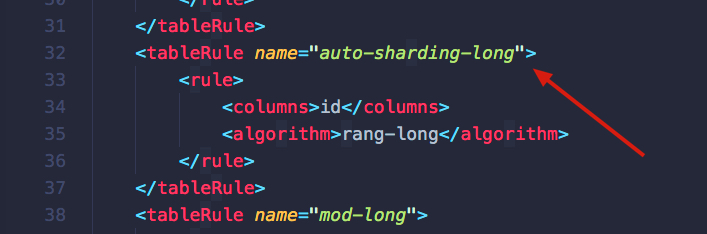
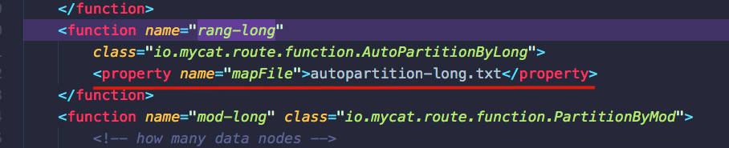
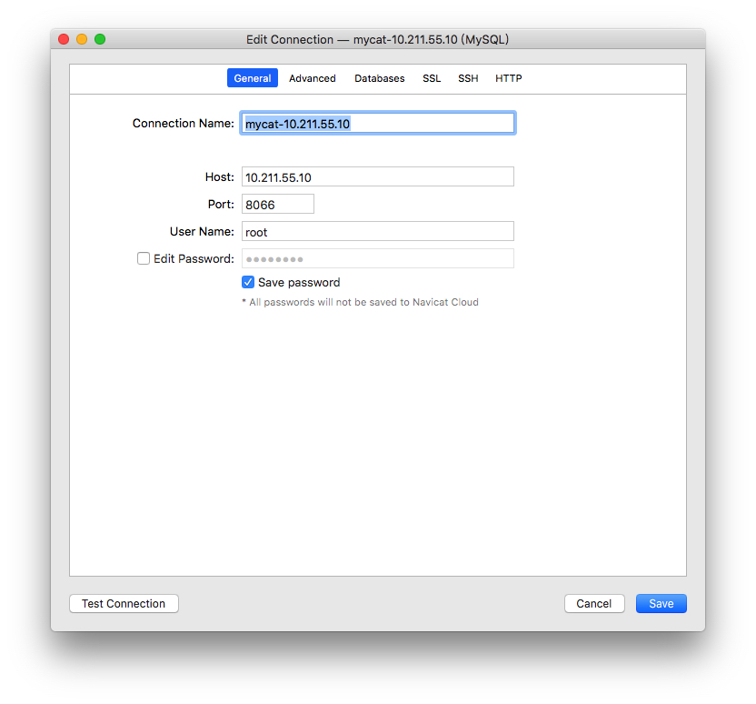
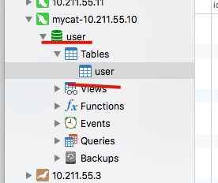

# 前言

我们通过之前的介绍已经了解到了mycat的基本情况，用它来做分库分表

下面我们就来安装和配置一下 mycat


我有准备了三台虚拟机

其中  mycat 部署在 10.211.55.10上，剩下的两个mysql 部署在 3 和 11 上。请根据这些来对应下面的配置。


Mysql的安装应该很多很多，大家一般都会，我就不细说了。这里主要讲 mycat的安装和配置

# 安装和配置

## 下载

[mycat下载地址](http://dl.mycat.io/1.6.7.3/20190828135747/)

最好下载这个版本的，不然有些地方可能不一样，导致运行出问题，我之前下载别的版本，导致访问不了

## 解压

使用 `tar -zxvf {文件名}`解压

## 配置

我们修改 ./mycat/conf/schema.xml文件

注意我的注释，需要改的参数我会在注释中注明

```xml

	<!-- 
		name 这个使用默认的就行，这样之后你连接数据库后，他会自己生成一个这个表
		checkSQLscheme 是否去掉SQL中的 scheme
		SQLMaxLimit select默认的limit值，仅对分片表有效。如果不是分片表，则不会有效
	 -->
	<schema name="TESTDB" checkSQLschema="true" sqlMaxLimit="100">
		<!-- auto sharding by id (long) -->
		<!-- name 是之后访问数据库需要的表名，可以更改，dataNode 根据下面的节点名进行更改 -->
		<table name="user" dataNode="dn11,dn3" rule="auto-sharding-long" />

		<!-- global table is auto cloned to all defined data nodes ,so can join
			with any table whose sharding node is in the same data node -->
		<!-- <table name="user" primaryKey="ID" type="global" dataNode="dn11,dn3" /> -->
		<!-- <table name="oc_call" primaryKey="ID" dataNode="dn1$0-743" rule="latest-month-calldate"
			/> -->
	</schema>
	<!-- <dataNode name="dn1$0-743" dataHost="localhost1" database="db$0-743"
		/> -->
	<!-- 
		name 和上面的保持一致，
		dataHost 和下面的节点名称保持一致，
		database 这个一定要注意，这个是你物理库的名称，一定要和下面 dataHost 中的ip地址上的数据库中的数据库名称保持一致
	-->
	<dataNode name="dn11" dataHost="localhost11" database="user_11" />
	<dataNode name="dn3" dataHost="localhost3" database="user_3" />
	<!--<dataNode name="dn4" dataHost="sequoiadb1" database="SAMPLE" />
	 <dataNode name="jdbc_dn1" dataHost="jdbchost" database="db1" />
	<dataNode	name="jdbc_dn2" dataHost="jdbchost" database="db2" />
	<dataNode name="jdbc_dn3" 	dataHost="jdbchost" database="db3" /> -->
	
	<!-- 
		maxCon 最大连接数
		minCon 最小连接数
		balance 0 不进行读写分离，读也全部落在写库上； 
					1 如果配置双主从模式 (M1->s1 m2->s2，并且互为主备) 正常情况下，m2,s1,s2参与读请求的负载均衡
					2 读写随机分配 ；
					3 读全部落在读库上
		writeType 0 所有写请求全部写在第一个 writeHost，只有第一个挂了才往后；1 随机。 mycat官方推荐为0
	 -->
	<dataHost name="localhost11" maxCon="1000" minCon="10" balance="0"
			  writeType="0" dbType="mysql" dbDriver="native" switchType="1"  slaveThreshold="100">
		<heartbeat>select user()</heartbeat>
		<!-- can have multi write hosts -->
		<!-- 
			写库，根据自己的实际环境进行更改
			url 为你物理数据库的地址
			用户名密码根据自己环境进行更改
		-->
		<writeHost host="hostM1" url="10.211.55.11:3306" user="root"
				   password="root">
			<!-- can have multi read hosts -->
			<!-- <readHost host="hostS2" url="192.168.1.200:3306" user="root" password="xxx" /> -->
		</writeHost>
		<!-- <writeHost host="hostS1" url="10.211.55.3:3316" user="root"
				   password="root" /> -->
		<!-- <writeHost host="hostM2" url="localhost:3316" user="root" password="123456"/> -->
	</dataHost>
	<dataHost name="localhost3" maxCon="1000" minCon="10" balance="0"
			  writeType="0" dbType="mysql" dbDriver="native" switchType="1"  slaveThreshold="100">
		<heartbeat>select user()</heartbeat>
		<!-- can have multi write hosts -->
		<writeHost host="hostM1" url="10.211.55.3:3306" user="root"
				   password="root">
			<!-- can have multi read hosts -->
			<!-- <readHost host="hostS2" url="192.168.1.200:3306" user="root" password="xxx" /> -->
		</writeHost>
		<!-- <writeHost host="hostS1" url="10.211.55.3:3316" user="root"
				   password="root" /> -->
		<!-- <writeHost host="hostM2" url="localhost:3316" user="root" password="123456"/> -->
	</dataHost>
```

## 注意这个

我们 使用 auto-sharding-long 这个来让他自动分片，但是这个会有问题

配置完之后你启动一下就知道了，他会说你配置的节点数小于分片配置中的数。这个是为什么呢？

我们看 conf目录下的 `rule.xml`

找到这个 



他是用的是 rang-long 算法，我们在这个文件中找到 下面这个标签，他是用的是下面这个 文件



我们再去 conf目录下找到这个文件,发现他有三个，我们注释掉第三个就行。因为我们只有两个sql节点，如果你自己配置了三个节点 就不会有问题。如果不是三个就要进行相应的修改

```
# range start-end ,data node index
# K=1000,M=10000.
0-500M=0
500M-1000M=1
#1000M-1500M=2
```

## 启动

在 bin 目录下 `./mycat console`启动一下


# 验证

我们使用navicat连接一下，

注意我们的端口是 8066，如果你之前没改过，默认密码是 123456






你们正常库默认应该是 TESTDB

我们使用 sql语句 `INSERT INTO `user`(id,username) VALUES (11,'test')`会发现他插入在了第一个节点配置的库中，第二个节点的库中没有

如果我们把 id 设置的非常大，大于500w,比如600w,那么就会插入第二个库中。这个是之前我们在那个 文本中配置的

