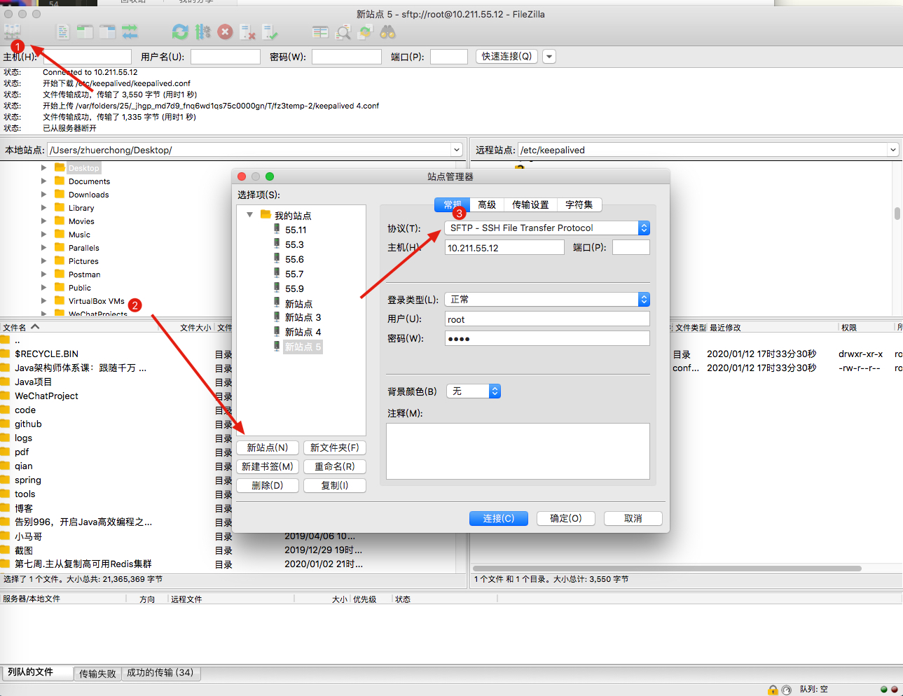
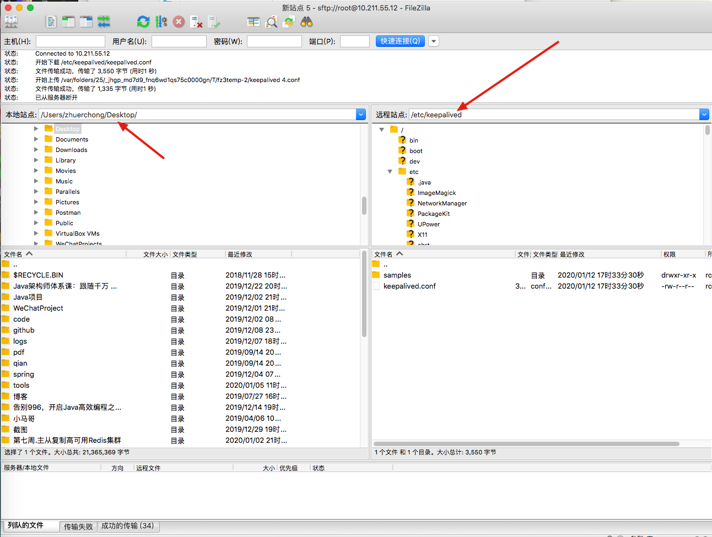

# 介绍

filezilla 可以从两台电脑上 通过 链接之后传输文件。

# 下载

从官网下载软件，[https://filezilla-project.org/download.php?platform=osx](https://filezilla-project.org/download.php?platform=osx)

# 使用说明

## 连接

## 传输文件

左边是 你本地目录，右边是服务器的目录

**你只需要选择好目录，然后将文件从一边拖到另一边就能完成文件传输**